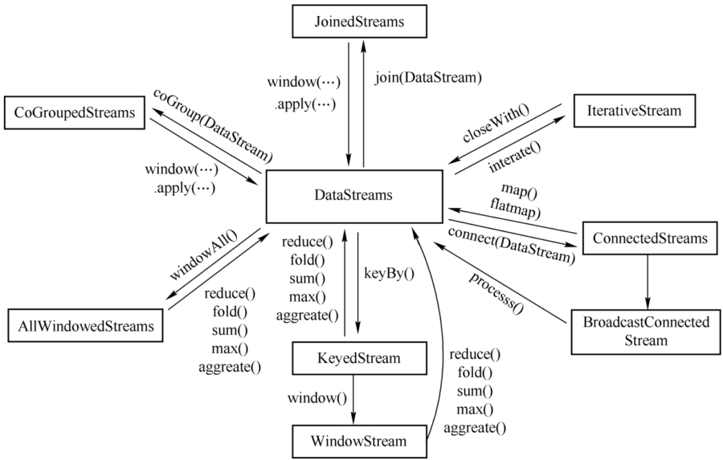

## Flink基础知识与API

Flink的重要特点；
- 事件驱动型（event-driven）:根据到来的事件触发计算、状态更新或其他外部动作，比如Kafka
- 流与批的世界观
    - Flink世界观中一切都是由流组成的，离线数据是有界限的流，实时数据是一个没有界限的流【有界流、无界流】
    - 而在Spark中，一切都是批次组成的，离线数据是大批次，实时数据是由一个一个无限的小批次组成的
    - 无界数据流：数据流有一个开始但是灭有结束
    - 有界数据流：数据流有明确定义的开始和结束
- 分层API
    - 高级语言：SQL
    - 声明式DSL语法：Table API
    - 核心API：DataStream/DataSet API 
    - 低级API：Stateful Stream Processing
- 支持有状态计算：flink1.4以后也支持中间结果缓存，相当于checkpoint操作
- 支持exactly-once语义：有且仅执行一次
- 支持事件时间（EventTime）

流处理API：environment -> source -> transform -> sink

### 1. Environment
- getExecutionEnvironment
    - 创建一个执行环境，表示当前执行程序的上下文
        - 程序独立调用，此方法返回本地执行环境
        - 程序提交到集群，此方法返回集群的执行环境
```
val env: ExecutionEnvironment = ExecutionEnvironment.getExecutionEnvironment
val env = StreamExecutionEnvironment.getExecutionEnvironment
```
- createLocalEnvironment：返回本地执行环境，需要在调用时指定默认的并行度
- createRemoteEnvironment
```
val env = StreamExecutionEnvironment.createLocalEnvironment(1)
val env = ExecutionEnvironment.createRemoteEnvironment("jobmanage-hostname", 6123,"YOURPATH//wordcount.jar")
```

### 2. DataSource
- 基于文本：readTextFile
- 基于Socket：socketTextStream
- 基于集合：fromCollection
- 自定义输入：addSource
    - FlinkKafkaConsumer011 从kafka队列中消费

代码参见：[SourceApp.scala](src/main/scala/cn/fancychuan/scala/SourceApp.scala)

### 3. Transform算子
在flink中，source之后，sink之前的中间所有过程，都可以认为是转换算子，这个跟spark中的转换算子不是一个概念。

基本转换算子：map, flatMap, filter

分区汇总转换算子
- keyBy
    - DataStream → KeyedStream：逻辑地将一个流拆分成不相交的分区，每个分区包含具有相同key的元素，在内部以hash的形式实现的
    - 基于key的hash code重分区
    - 同一个key
- max/maxBy, min/minBy, sum
- reduce

多流转换算子
- split, select
- connect, CoMap, CoFlatMap
- union

整个转换算子涉及到的Stream类型


### 4. 支持的数据类型
- 基本的数据类型
- java和Scala元组（tuple）
- Scala样例类
- Java简单对象（POJO）
- 其它（Arrays, Lists, Maps, Enums, 等等）

### 5. 实现UDF-更细粒度的控制流
#### 5.1 函数类
Flink暴露了所有UDF函数的接口，实现方式为接口或者抽象类。比如MapFunction, FilterFunction, ProcessFunction

DataStream的其他函数
- broadcast
- shuffle：将数据均匀分发
- forward
- rebalance
- rescale
- global：所有分区合并到一个
- iterate

#### 5.2 匿名函数类
#### 5.3 富函数类
“富函数”是DataStream API提供的一个函数类的接口，所有Flink函数类都有其Rich版本。它与常规函数的不同在于，可以获取运行环境的上下文，并拥有一些生命周期方法，所以可以实现更复杂的功能

比如RichMapFunction， RichFlatMapFunction

Rich Function有一个生命周期的概念，典型的方法有：
- open()方法是rich function的初始化方法。一个算子（比如map）被调用之前open()会被调用
- close()方法是生命周期中的最后一个调用的方法，做一些清理工作
- getRuntimeContext()方法提供了函数的RuntimeContext的一些信息，例如函数执行的并行度，任务的名字，以及state状态

### 6.Sink
FlinkKafkaProducer011