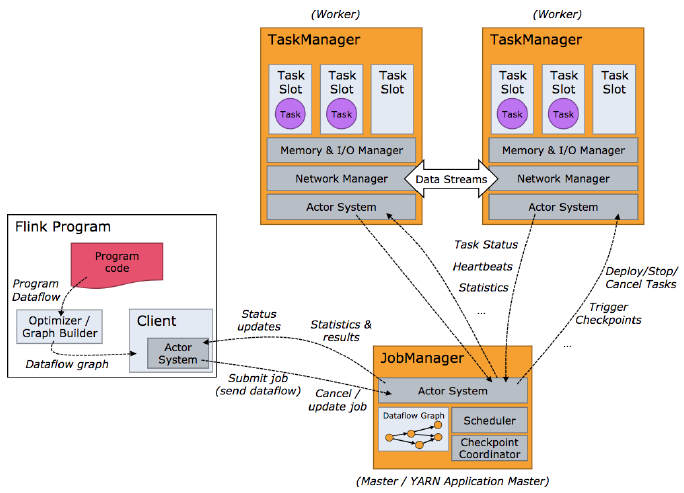
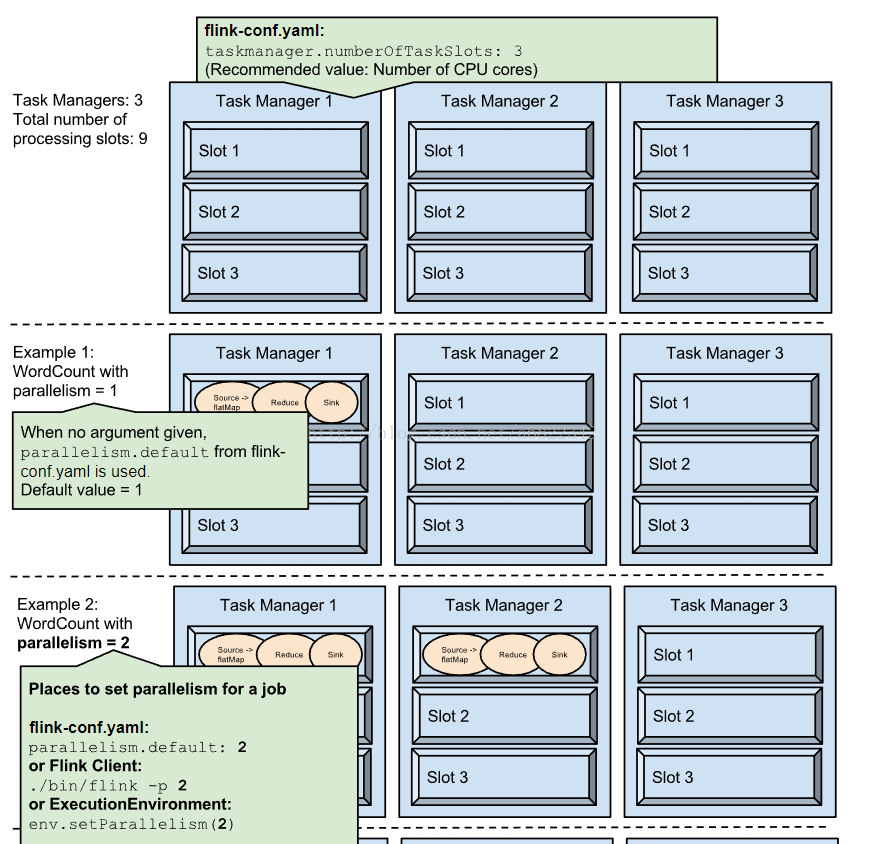
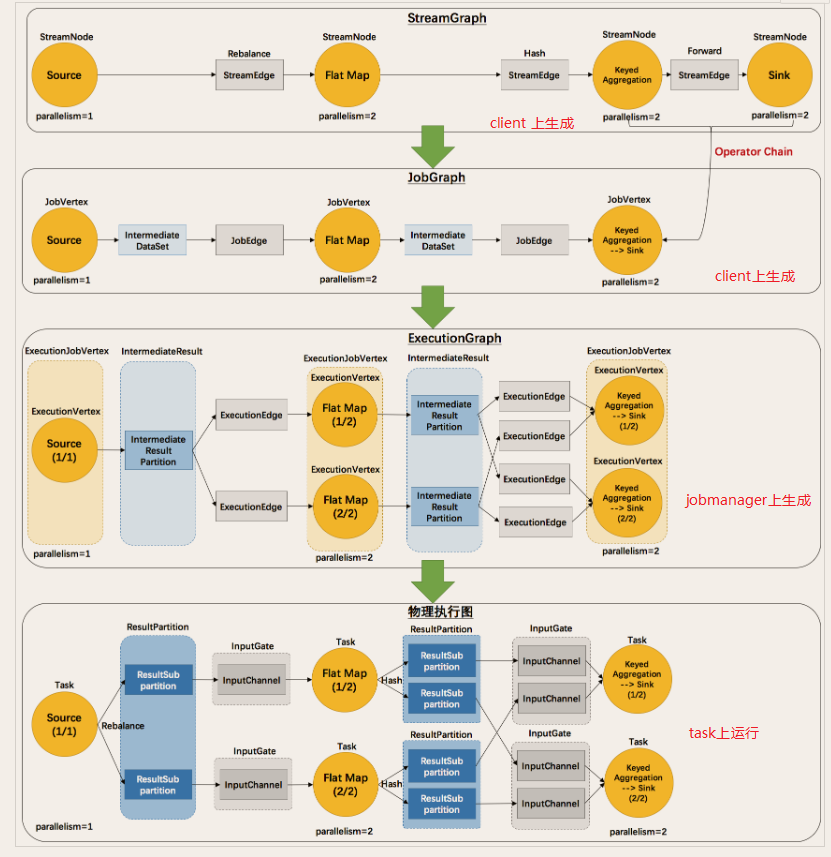

## Flink
Flink项目的理念是：“Apache Flink是为分布式、高性能、随时可用以及准确的流处理应用程序打造的开源流处理框架”

Apache Flink 是一个框架和分布式处理引擎，用于在无边界和有边界数据流上进行有状态的计算。Flink 能在所有常见集群环境中运行，并能以内存速度和任意规模进行计算
- 有界流
- 无界流

Flink的应用场景
- 实时推荐系统
- 复杂事件处理：比如车载传感器等实时故障检测
- 实时欺诈检测
- 实时数仓与ETL
- 流数据分析
- 实时报表分析

Flink的特点和优势
- 同时支持高吞吐、低延迟、高性能
    - Storm低吞吐
    - Spark Streaming也是高吞吐
- 支持事件事件（Event Time）概念
    - 目前大多数框架窗口计算使用的都是系统事件（ProcessTime）
- 支持有状态计算
    - 指算子的中间结果存在内存或文件系统中，下一个事件到来的时候继续计算
    - spark默认是无状态的，而flink默认是有状态的
- 支持高度灵活的窗口操作
    - Flink将窗口划分为基于Time、Count、Session以及Data-driven等类型的窗口操作
- 基于轻量级分布式快照（checkpoint）事件的容错
- 基于JVM实现独立的内存管理
- 保存点（Save Point）
    - 默认不开启，需要手动开启
    - 一般用于升级，checkpoint一般用于容错

流式计算框架的对比
 
### WordCount应用
- 批处理的方式实现：[DataSetWcApp.scala](src/main/scala/cn/fancychuan/scala/quickstart/DataSetWcApp.scala)
- 流处理的方式实现：[DataStreamWcApp.scala](src/main/scala/cn/fancychuan/scala/quickstart/DataStreamWcApp.scala)

作业提交方式：
1.通过web界面提交
2.通过flink命令
```
bin/flink run -c cn.fancychuan.scala.quickstart.DataStreamWcApp \
-p 2 /home/appuser/forlearn/flink/flink-1.0-SNAPSHOT.jar \
--host hadoop101 --port 7777
```

不同并行度设置对作业的影响：
- 只使用全局设置的默认并行度

- 既设计作业默认并行度，又给算子单独设置

- 只设置作业默认的并行度


### 4运行时架构
#### 4.1 Flink运行时的组件
- 作业管理器（JobManager）
    - 控制一个应用程序执行的主进程
    - 应用程序包括：作业图（JobGraph）、逻辑数据流图（logical dataflow graph）和打包了所有的类、库和其它资源的JAR包
    - 会把一个逻辑数据流图转成物理层面的数据流图，叫“执行图”（ExecutionGraph），包含了所有可以并发执行的任务
    - 向ResourceManager申请资源（也就是插槽slot）
    - 获得足够的资源后，就会将执行图分发到真正运行task的TaskManager上
    - 负责所有需要中央协调的操作，比如checkpoints的协调
- 资源管理器（ResourceManager）
    -主要负责管理TaskManager上的slot，TaskManger插槽是Flink中定义的处理资源单元
    - 负责终止空闲的TaskManager，释放计算资源
    - 如果ResourceManager没有足够的插槽来满足JobManager的请求，它还可以向资源提供平台发起会话，以提供启动TaskManager进程的容器【啥意思？】
- 任务管理器（TaskManager）
    - Flink中的工作进程
    - 插槽的数量限制了TaskManager能够执行的任务数量
    - 启动之后，TaskManager会向资源管理器注册它的插槽
    - 收到资源管理器的指令后，TaskManager就会将一个或者多个插槽提供给JobManager调用
    - 执行过程中，一个TaskManager可以跟其它运行同一应用程序的TaskManager交换数据
- 分发器（Dispatcher）
    - 可以跨作业运行，它为应用提交提供了REST接口
    - 当一个应用被提交执行时，分发器就会启动并将应用移交给一个JobManager
    - Dispatcher在架构中可能并不是必需的

#### 4.2 任务作业提交流程
任务提交和组件交互流程


Yarn模式任务提交流程


#### 4.3 任务调度原理

> 客户端不是运行时的一部分，也不是程序执行的一部分，它用于准备并发送dataflow(JobGraph)给Master(JobManager)，然后，客户端断开连接或者维持连接以等待接收计算结果
- 4.3.1 TaskManger与Slots
    - TaskManager是一个JVM进程，可能会在独立的线程上执行一个或多个subtask
    - worker（TaskManager）通过task slot来进行控制（一个worker至少有一个task slot）
    - 每个task slot表示TaskManager拥有资源的一个固定大小的子集，比如一个TaskManager上有3个slot，那么TaskManager会将其管理的内存分成三份给各个slot
    - slot和slot之间的内容是彼此隔离的，但CPU是共享的
    - 一个TaskManager多个slot意味着更多的subtask可以共享同一个JVM，在同一个JVM进程中的task将共享TCP连接（基于多路复用）和心跳消息
    - 默认情况下，flink允许子任务共享slot，即使它们是不同任务的子任务（前提是它们来自同一个job）。由此一个slot是可以保存作业的整个管道的
    - Task Slot是静态的概念，是指TaskManager具有的并发执行能力，并行度parallelism是动态概念，即TaskManager运行程序时实际使用的并发能力
    - 一个流处理程序需要的slot数量，其实就是所有任务中最大的那个并行度
    
> 子任务共享Slot

> 并行度与slot的使用情况示例


- 4.3.2 程序与数据流（DataFlow）
    - 程序由三部分组成：Source（读数据）、Transformation（用算子加工）和Sink（输出）
    - 程序会被映射成“逻辑数据流”（dataflows）
    - 每一个dataflow以一个或多个sources开始以一个或多个sinks结束。dataflow类似于任意的有向无环图（DAG）

- 4.3.3 执行图（ExecutionGraph）
    - 执行图可以分成四层：StreamGraph -> JobGraph -> ExecutionGraph -> 物理执行图
        - StreamGraph：由Flink程序直接映射成的数据流图，也叫逻辑流图，表示的是计算逻辑的高级视图，能体现程序的拓扑结构
        - JobGraph：StreamGraph经过优化后生成了 JobGraph，提交给 JobManager 的数据结构
            - 将多个符合条件的节点 chain 在一起作为一个节点，减少数据在节点之间流动所需要的序列化/反序列化/传输消耗
        - ExecutionGraph：根据 JobGraph 生成ExecutionGraph。ExecutionGraph是JobGraph的并行化版本，是调度层最核心的数据结构
        - 物理执行图：JobManager 根据 ExecutionGraph 对 Job 进行调度后，在各个TaskManager 上部署 Task 后形成的“图”，并不是一个具体的数据结构

        

- 4.4.4 并行度（Parallelism）
    - 一个流有一个或多个分区，一个算子可以包含一个或多个subtask，这些子任务可以在不同线程、不同物理机或不同容器中互不依赖执行
    - 一个特定算子的子任务的个数，成为并行度
    - 一般的，一个程序的并行度可以认为是其所有算子中最大的并行度（不同算子可以有不同的并行度）
    - stream在算子的的传输形式有两种：
        - one-to-one(forwarding)：一对一，比如map、flatMap，类似于spark中的窄依赖
        - Redistributing：分区会发生变化，例如，keyBy() 基于hashCode重分区、broadcast和rebalance会随机重新分区，这些算子都会引起redistribute过程，类似于shuffle操作，宽依赖
- 4.4.5 任务链（Operator Chains）
    - 将算子链接成task是非常有效的优化：它能减少线程之间的切换和基于缓存区的数据交换，在减少时延的同时提升吞吐量
    - 要求：相同并行度的one to one操作
.png)

> 并行：
> 数据并行 —— 同一个任务，不同的并行子任务，同时处理不同的数据
> 任务并行 —— 同一时间，不同的slot在执行不同的任务


### 5.时间语义与watermark
窗口Window相关知识查看[Flink基础知识与API.md](./Flink基础知识与API.md)
#### 5.1时间语义
- Event Time：事件创建的时间
- Ingestion Time：数据进入Flink的时间
- Process Time： 执行操作算子的本地时间，与机器相关
> Flink默认是使用process time时间

EventTime的引入
```
env.setStreamTimeCharacteristic(TimeCharacteristic.EventTime)
```

#### 5.2 Watermark
> 乱序：Flink接收到事件的先后顺序不是严格按照Event Time顺序排列的。此时只根据EventTime无法明确数据是否到位，又不能无限期的等下去。因此需要有Watermark这样的一个机制，等待一个特定的时间后触发Window去计算
- Watermark是一种衡量event time进展的机制，可以理解为一个延迟触发机制，
  已到达的数据中最大的maxEventTime减去允许的延迟时间等于窗口的停止时间，则触发窗口的计算，
  也就是说window的执行也是由Watermark触发
- 数据流中的Watermark用于表示timestamp小于Watermark的数据都已经到达
- Watermark是基于数据携带的时间戳生产的，如果运行过程中无法获取新的数据，那么没有被触发的窗口将永远不会被触发
- Watermark用来让程序自己平衡延迟和结果正确性，主要用于处理乱序事件，通常用watermark机制结合window实现


watermark的特点：
- watermark是一条特殊的数据记录（继承StreamElement）【相当于只是时间戳】
- watermark必须是单调递增，以确保任务的EventTime时钟在向前推进
- watermark与数据的时间戳相关

watermark的传递
- 从上游到下游，需要将watermark广播到下游
- 不同分区来的watermark，会存到在当前分区的Partition WM中，并从中选取最小的watermark广播到下游分区
- 如果新来watermark后，当前分区的最小watermark不变，那么不会向下游广播watermark

watermark的设定
- 设置的延迟太久，则结果产出慢，解决办法是在水位线到达之前输出一个近似结果
- 如果watermark到达得太早，则可能受到错位的结果，不过Flink处理迟到数据的机制可以解决这个问题

##### Watermark的引入
```
dataStream.assignTimestampAndWatermarks(new MyAssigner())
```
MyAssigner有两种类型，都继承自TimestampAssigner：
> TimestampAssigner定义了抽取时间戳以及生成watermark的方法
- AssignerWithPeriodicWatermarks
    - 周期性生成watermark，默认周期是200毫秒，修改生成周期的方法：env.getConfig.setAutoWatermarkInterval(100);
    - 自定义实现：[MyPeriodicAssigner.java](src/main/java/cn/fancychuan/assigner/MyPeriodicAssigner.java)
    - 使用场景：在流数据密集，周期性生成
    - 两种特殊场景：
        - 事先知道数据流是单调递增的，没有乱序，则可以使用 AscendingTimestampExtractor，这个类直接使用数据的时间戳生产Watermark
        - 能大致估摸出数据流中的最大延迟时间，则可以使用 BoundedOutOfOrdernessTimestampExtractor
        - 这两种情况参考 [JavaWatermarkApp.java](src/main/java/cn/fancychuan/JavaWatermarkApp.java)
- AssignerWithPunctuatedWatermarks
    - 断点式生成watermark，可以根据每条数据的情况来选择是否生成Watermark，处理方法是：checkAndGetNextWatermark
    - 自定义时间：[MyPunctuatedAssigner.java](src/main/java/cn/fancychuan/assigner/MyPunctuatedAssigner.java)
    - 使用场景：流数据稀疏
    

##### 示例1：Watermark设置延迟为2，滚动窗口大小为5
参见代码：[JavaWatermarkApp.java](src/main/java/cn/fancychuan/JavaWatermarkApp.java)
```
sensor_6,1547718199,35.8    # [195,200) 199存入这个窗口
sensor_6,1547718202,15.4    # 202存入[200,205)这个窗口，同时watermark(200)触发了上个窗口[195,200)的计算
sensor_6,1547718203,13.4    # 203存入[200,205)这个窗口
sensor_6,1547718204,14.4    # 204存入[200,205)这个窗口
sensor_6,1547718205,15.4    # 205存入[205,210)这个窗口，这个时候不会有任何计算
sensor_6,1547718206,16.4
sensor_6,1547718207,16.4    # 207存入[205,210)这个窗口，同时watermark(205)触发了[200,205)的计算
```

Window的起始位置计算逻辑：org.apache.flink.streaming.api.windowing.windows.TimeWindow.getWindowStartWithOffset
```
public static long getWindowStartWithOffset(long timestamp, long offset, long windowSize) {
	return timestamp - (timestamp - offset + windowSize) % windowSize;
}
```

##### 示例2：Watermark设置延迟为2，滚动窗口大小为5，允许迟到数据1分钟内，并开启兜底方案
```
// 设置允许的迟到时间。这里例子中，每5秒一个窗口，1分钟之内这个窗口都不会关闭，每来一个数据更新一次结果
.allowedLateness(Time.minutes(1))
// 兜底方案，将超过1分钟都没有到达的数据放到侧输出流中
.sideOutputLateData(outputTag)
```
详细过程如下
```
sensor_1,1547718211,36.1    # 211存入[210,215)窗口，不会触发计算
sensor_1,1547718215,36.5    # 215存入[215,220)窗口，不会触发计算
sensor_1,1547718214,37.5    # 214存入[210,215)窗口，不会触发计算
sensor_1,1547718217,36.5    # 215存入[215,220)窗口，触发[200,215)这个窗口计算
sensor_1,1547718212,32.2    # 212存入[210,215)窗口，不会触发计算
sensor_1,1547718218,36.5    # 218存入[215,220)窗口，不会触发计算
sensor_1,1547718222,31.1    # 222存入[220,225)窗口，触发[215,220)这个窗口计算
sensor_1,1547718280,30.5    # 280存入[280,285)窗口，触发[220,225)这个窗口计算（在275之前的所有窗口都会被触发，运维Watermark已经到了278）
sensor_1,1547718212,32.2    # 212原本属于[210,215)，但现在Watermark已经到了278，超过了60s，属于迟到数据，按迟到机制处理
sensor_1,1547718288,33.8    # 288存入[285,290)窗口，触发[280,285)这个窗口计算
sensor_1,1547718228,32.2    # 228存入[225,230)窗口，因为Watermark=278还没到这个窗口所允许的最大迟到时间，也就是290，因此228直接触发了[225,230)这个窗口的计算
sensor_1,1547718225,13.2    # Watermark=278，所关闭的窗口为[210,215)，因此225还是触发了[225,230)这个窗口的计算
sensor_1,1547718292,33.8    # 292存入[290,292)窗口，Watermark=290，因此关闭了[225,230)这个窗口
sensor_1,1547718225,13.2    # 再来一个225的时候，[225,230)这个窗口已经关闭，因此，225迟到了
```


### Flink应用
- [基于flink-sql的实时流计算web平台](https://github.com/zhp8341/flink-streaming-platform-web)
 

1. 是什么
2. 什么时候用
3. 怎么用