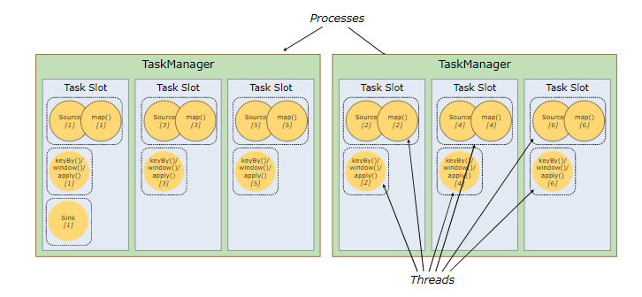

## Flink
Flink项目的理念是：“Apache Flink是为分布式、高性能、随时可用以及准确的流处理应用程序打造的开源流处理框架”

Apache Flink 是一个框架和分布式处理引擎，用于在无边界和有边界数据流上进行有状态的计算。Flink 能在所有常见集群环境中运行，并能以内存速度和任意规模进行计算
- 有界流
- 无界流

Flink的应用场景
- 实时推荐系统
- 复杂事件处理：比如车载传感器等实时故障检测
- 实时欺诈检测
- 实时数仓与ETL
- 流数据分析
- 实时报表分析

Flink的特点和优势
- 同时支持高吞吐、低延迟、高性能
    - Storm低吞吐
    - Spark Streaming也是高吞吐
- 支持事件事件（Event Time）概念
    - 目前大多数框架窗口计算使用的都是系统事件（ProcessTime）
- 支持有状态计算
    - 指算子的中间结果存在内存或文件系统中，下一个事件到来的时候继续计算
    - spark默认是无状态的，而flink默认是有状态的
- 支持高度灵活的窗口操作
    - Flink将窗口划分为基于Time、Count、Session以及Data-driven等类型的窗口操作
- 基于轻量级分布式快照（checkpoint）事件的容错
- 基于JVM实现独立的内存管理
- 保存点（Save Point）
    - 默认不开启，需要手动开启
    - 一般用于升级，checkpoint一般用于容错

流式计算框架的对比
 
#### WordCount应用
- 批处理的方式实现：[DataSetWcApp.scala](src/main/scala/cn/fancychuan/scala/quickstart/DataSetWcApp.scala)
- 流处理的方式实现：[DataStreamWcApp.scala](src/main/scala/cn/fancychuan/scala/quickstart/DataStreamWcApp.scala)

不同并行度设置对作业的影响：
- 只使用全局设置的默认并行度

- 既设计作业默认并行度，又给算子单独设置

- 只设置作业默认的并行度

#### 4运行时架构
##### 4.1 Flink运行时的组件
- 作业管理器（JobManager）
    - 控制一个应用程序执行的主进程
    - 应用程序包括：作业图（JobGraph）、逻辑数据流图（logical dataflow graph）和打包了所有的类、库和其它资源的JAR包
    - 会把一个逻辑数据流图转成物理层面的数据流图，叫“执行图”（ExecutionGraph），包含了所有可以并发执行的任务
    - 向ResourceManager申请资源（也就是插槽slot）
    - 获得足够的资源后，就会将执行图分发到真正运行task的TaskManager上
    - 负责所有需要中央协调的操作，比如checkpoints的协调
- 资源管理器（ResourceManager）
    -主要负责管理TaskManager上的slot，TaskManger插槽是Flink中定义的处理资源单元
    - 负责终止空闲的TaskManager，释放计算资源
    - 如果ResourceManager没有足够的插槽来满足JobManager的请求，它还可以向资源提供平台发起会话，以提供启动TaskManager进程的容器【啥意思？】
- 任务管理器（TaskManager）
    - Flink中的工作进程
    - 插槽的数量限制了TaskManager能够执行的任务数量
    - 启动之后，TaskManager会向资源管理器注册它的插槽
    - 收到资源管理器的指令后，TaskManager就会将一个或者多个插槽提供给JobManager调用
    - 执行过程中，一个TaskManager可以跟其它运行同一应用程序的TaskManager交换数据
- 分发器（Dispatcher）
    - 可以跨作业运行，它为应用提交提供了REST接口
    - 当一个应用被提交执行时，分发器就会启动并将应用移交给一个JobManager
    - Dispatcher在架构中可能并不是必需的

##### 4.2 任务作业提交流程
任务提交和组件交互流程

Yarn模式任务提交流程

##### 4.3 任务调度原理

> 客户端不是运行时的一部分，也不是程序执行的一部分，它用于准备并发送dataflow(JobGraph)给Master(JobManager)，然后，客户端断开连接或者维持连接以等待接收计算结果
- 4.3.1 TaskManger与Slots
    - TaskManager是一个JVM进程，可能会在独立的线程上执行一个或多个subtask
    - worker（TaskManager）通过task slot来进行控制（一个worker至少有一个task slot）
    - 每个task slot表示TaskManager拥有资源的一个固定大小的子集，比如一个TaskManager上有3个slot，那么TaskManager会将其管理的内存分成三份给各个slot
    - slot和slot之间的内容是彼此隔离的，但CPU是共享的
    - 一个TaskManager多个slot意味着更多的subtask可以共享同一个JVM，在同一个JVM进程中的task将共享TCP连接（基于多路复用）和心跳消息
    - 默认情况下，flink允许子任务共享slot，即使它们是不同任务的子任务（前提是它们来自同一个job）。由此一个slot是可以保存作业的整个管道的
    - Task Slot是静态的概念，是指TaskManager具有的并发执行能力，并行度parallelism是动态概念，即TaskManager运行程序时实际使用的并发能力

> 子任务共享Slot

> 并行度与slot的使用情况示例

    
#### Flink应用
- [基于flink-sql的实时流计算web平台](https://github.com/zhp8341/flink-streaming-platform-web)
 

1. 是什么
2. 什么时候用
3. 怎么用