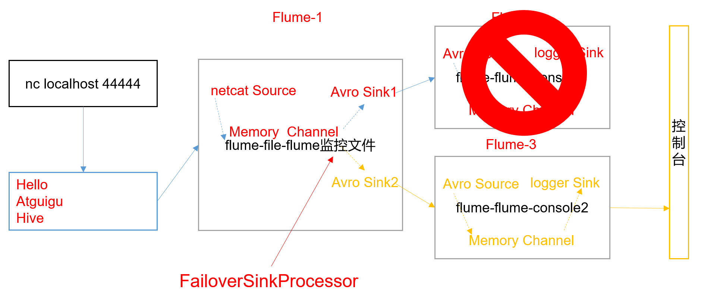
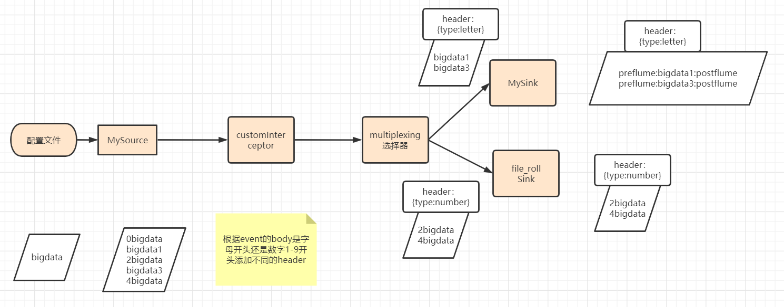

## Flume使用示例


#### 1.监控端口数据官方案例

[flume-netcat-logger.conf](conf/flume-netcat-logger.conf)

启动命令
```
bin/flume-ng agent \
-n a1 \
-c /usr/local/flume/conf/ \
-f /home/appuser/forlearn/flumejob/flume-netcat-logger.conf \
-Dflume.root.logger=DEBUG,console
```


#### 2.实时读取本地文件到HDFS
> 使用exec source来执行 tail -f

前提条件：需要能够写数据到HDFS，因此需要hadoop的jar包，需要把以下的jar包放到flume的lib下，如果集群已经安装好了hadoop，那就不需要
```
commons-configuration-1.6.jar
hadoop-auth-2.7.2.jar
hadoop-common-2.7.2.jar
hadoop-hdfs-2.7.2.jar
commons-io-2.4.jar
htrace-core-3.1.0-incubating.jar
```

[flume-file-hdfs.conf](conf/flume-file-hdfs.conf)

启动命令：
```
bin/flume-ng agent \
-c conf \
-n a2 \
-f /home/appuser/forlearn/flumejob/flume-file-hdfs.conf \
-Dflume.root.logger=DEBUG,console
```
> 让Flume存到HDFS的时候自动存为分区
> hdfs://hadoop101:8020/forlearn/flume/%Y%m%d/%H
> 要支持这种形式，需要在Event的header中有Timestamp，所以需要配置：
> hdfs.useLocalTimeStamp = true 

#### 3. 实时读取整个目录下的文件到HDFS
> 使用 spooldir source

[flume-dir-hdfs.conf](conf/flume-dir-hdfs.conf)

启动第3个agent：使用tail -f 不够稳定，严重依赖tail命令。改为：监控特定目录收集日志
```
bin/flume-ng agent \
-c conf \
-n a3 \
-f /home/appuser/forlearn/flumejob/flume-dir-hdfs.conf \
-Dflume.root.logger=DEBUG,console
```

#### 4. 使用taildir来实时监控目录下多个文件

[flume-taildir-hdfs.conf](conf/flume-taildir-hdfs.conf)

```
bin/flume-ng agent \
-c conf \
-n a3 \
-f /home/appuser/forlearn/flumejob/flume-taildir-hdfs.conf \
-Dflume.root.logger=DEBUG,console
```

#### 5. 串联
监听hadoop101上面的44444端口，并通过AvroSink传到hadoop102的AvroSource，然后输出到控制台

配置如下：
- [flume-chuanlian-agent1.conf](conf/flume-chuanlian-agent1.conf)
- [flume-chuanlian-agent2.conf](conf/flume-chuanlian-agent2.conf)

启动命令（注意启动顺序）
```
# hadoop102上先启动avro source
bin/flume-ng agent \
-n agent2 \
-c /usr/local/flume/conf/ \
-f /home/appuser/forlearn/flumejob/flume-chuanlian-agent2.conf \
-Dflume.root.logger=DEBUG,console


# hadoop101再启动avro sink
bin/flume-ng agent \
-n agent1 \
-c /usr/local/flume/conf/ \
-f /home/appuser/forlearn/flumejob/flume-chuanlian-agent1.conf \
-Dflume.root.logger=DEBUG,console
```

#### 6.单数据源多出口案例（选择器）


##### 6.1使用默认的选择器：复制
- agent1监控日志，将信息复制给agent2和agent3：[flume-selector-replicating-agent1.conf](flume-selector-replicating-agent1.conf)
- agent2负责从avro中读取信息，然后写入hdfs：[flume-selector-replicating-agent2.conf](flume-selector-replicating-agent2.conf)
- agent3负责从avro中读取信息，然后写入本地文件：[flume-selector-replicating-agent3.conf](flume-selector-replicating-agent3.conf)

启动命令
```
# 在hadoop102上启动agent2和agent3
bin/flume-ng agent \
-n agent2 \
-c /usr/local/flume/conf/ \
-f /home/appuser/forlearn/flumejob/flume-selector-replicating-agent2.conf \
-Dflume.root.logger=DEBUG,console

bin/flume-ng agent \
-n agent3 \
-c /usr/local/flume/conf/ \
-f /home/appuser/forlearn/flumejob/flume-selector-replicating-agent3.conf \
-Dflume.root.logger=DEBUG,console

# 在hadoop101上启动agent1
bin/flume-ng agent \
-n agent1 \
-c /usr/local/flume/conf/ \
-f /home/appuser/forlearn/flumejob/flume-selector-replicating-agent1.conf \
-Dflume.root.logger=DEBUG,console
```
结果在hadoop102的/home/appuser/forlearn/flumejob/selector目录下可以看到如下文件：
```
[appuser@hadoop102 selector]$ pwd
/home/appuser/forlearn/flumejob/selector
[appuser@hadoop102 selector]$ ll
total 72
-rw-rw-r-- 1 appuser appuser   862 May 29 23:35 1622302484716-1
-rw-rw-r-- 1 appuser appuser     0 May 29 23:35 1622302484716-2
-rw-rw-r-- 1 appuser appuser  6419 May 29 23:35 1622302484716-3
-rw-rw-r-- 1 appuser appuser     0 May 29 23:36 1622302484716-4
-rw-rw-r-- 1 appuser appuser     0 May 29 23:36 1622302484716-5
-rw-rw-r-- 1 appuser appuser     0 May 29 23:37 1622302634781-1
```

##### 6.2 使用multiplexing
- agent1监控端口：[flume-selector-multiplexing-agent1.conf](conf/flume-selector-multiplexing-agent1.conf)
    - 使用拦截器加上静态信息：wherefrom:bigdata
    - 通过多路选择器判断event需要发往哪个目标channel
- agent2负责从avro中读取信息，然后写入hdfs：[flume-selector-multiplexing-agent2.conf](flume-selector-multiplexing-agent2.conf)
- agent3负责从avro中读取信息，然后写入本地文件：[flume-selector-multiplexing-agent3.conf](flume-selector-multiplexing-agent3.conf)

启动命令
```
# 在hadoop102上启动agent2和agent3
bin/flume-ng agent \
-n agent2 \
-c /usr/local/flume/conf/ \
-f /home/appuser/forlearn/flumejob/flume-selector-multiplexing-agent2.conf \
-Dflume.root.logger=DEBUG,console

bin/flume-ng agent \
-n agent3 \
-c /usr/local/flume/conf/ \
-f /home/appuser/forlearn/flumejob/flume-selector-multiplexing-agent3.conf \
-Dflume.root.logger=DEBUG,console

# 在hadoop101上启动agent1
bin/flume-ng agent \
-n agent1 \
-c /usr/local/flume/conf/ \
-f /home/appuser/forlearn/flumejob/flume-selector-multiplexing-agent1.conf \
-Dflume.root.logger=DEBUG,console
```
> 在这个案例中agent3会拿不到任何数据

#### 7. sink组
单个source-channel，多个sink的场景，需要使用sink组

##### 7.1 负载均衡
- agent1监听端口，然后通过channel传给sink组，sink组采用load_balance处理器：[flume-sinkgroup-balance-agent1.conf](conf/flume-sinkgroup-balance-agent1.conf)
- agent2从avro中读取信息打印到控制台：[flume-sinkgroup-balance-agent2.conf](conf/flume-sinkgroup-balance-agent2.conf)
- agent3同agent2：[flume-sinkgroup-balance-agent3.conf](conf/flume-sinkgroup-balance-agent3.conf)

启动命令
```
# 在hadoop102上启动agent2和agent3
bin/flume-ng agent \
-n agent2 \
-c /usr/local/flume/conf/ \
-f /home/appuser/forlearn/flumejob/flume-sinkgroup-balance-agent2.conf \
-Dflume.root.logger=DEBUG,console

bin/flume-ng agent \
-n agent3 \
-c /usr/local/flume/conf/ \
-f /home/appuser/forlearn/flumejob/flume-sinkgroup-balance-agent3.conf \
-Dflume.root.logger=DEBUG,console

# 在hadoop101上启动agent1
bin/flume-ng agent \
-n agent1 \
-c /usr/local/flume/conf/ \
-f /home/appuser/forlearn/flumejob/flume-sinkgroup-balance-agent1.conf \
-Dflume.root.logger=DEBUG,console
```

##### 7.2 故障转移


- agent1监听端口，然后通过channel传给sink组，sink组采用failover处理器进行故障转移：[flume-sinkgroup-failover-agent1.conf](conf/flume-sinkgroup-failover-agent1.conf)
- agent2使用[flume-sinkgroup-balance-agent2.conf](conf/flume-sinkgroup-balance-agent2.conf)
- agent3使用[flume-sinkgroup-balance-agent2.conf](conf/flume-sinkgroup-balance-agent3.conf)

启动命令
```
# 在hadoop102上启动agent2和agent3
bin/flume-ng agent \
-n agent2 \
-c /usr/local/flume/conf/ \
-f /home/appuser/forlearn/flumejob/flume-sinkgroup-balance-agent2.conf \
-Dflume.root.logger=DEBUG,console

bin/flume-ng agent \
-n agent3 \
-c /usr/local/flume/conf/ \
-f /home/appuser/forlearn/flumejob/flume-sinkgroup-balance-agent3.conf \
-Dflume.root.logger=DEBUG,console

# 在hadoop101上启动agent1
bin/flume-ng agent \
-n agent1 \
-c /usr/local/flume/conf/ \
-f /home/appuser/forlearn/flumejob/flume-sinkgroup-failover-agent1.conf \
-Dflume.root.logger=DEBUG,console
```
实践结果：
- 因为k2（也就是agent3）的优先级比较高，由此event优先发给k2，k1处于闲置状态
- agent3退出之后，agent2接手，也就是k1接手
- 如果在规定时间内，k2恢复了，也就是agent3恢复了，event会继续发给k2
```
# k2崩溃退出
2021-05-30 08:57:35,860 (SinkRunner-PollingRunner-FailoverSinkProcessor) [DEBUG - org.apache.flume.sink.AbstractRpcSink.destroyConnection(AbstractRpcSink.java:247)] Rpc sink k2 closing Rpc client: NettyAvroRpcClient { host: hadoop102, port: 4142 }
2021-05-30 08:57:35,865 (SinkRunner-PollingRunner-FailoverSinkProcessor) [WARN - org.apache.flume.sink.FailoverSinkProcessor.process(FailoverSinkProcessor.java:188)] Sink k2 failed and has been sent to failover list
org.apache.flume.EventDeliveryException: Failed to send events
        at org.apache.flume.sink.AbstractRpcSink.process(AbstractRpcSink.java:389)
        at org.apache.flume.sink.FailoverSinkProcessor.process(FailoverSinkProcessor.java:185)
        at org.apache.flume.SinkRunner$PollingRunner.run(SinkRunner.java:145)
        at java.lang.Thread.run(Thread.java:748)
Caused by: org.apache.flume.EventDeliveryException: NettyAvroRpcClient { host: hadoop102, port: 4142 }: Failed to send batch
        at org.apache.flume.api.NettyAvroRpcClient.appendBatch(NettyAvroRpcClient.java:314)
        at org.apache.flume.sink.AbstractRpcSink.process(AbstractRpcSink.java:373)


# k2恢复
2021-05-30 08:58:26,725 (SinkRunner-PollingRunner-FailoverSinkProcessor) [INFO - org.apache.flume.sink.AbstractRpcSink.createConnection(AbstractRpcSink.java:205)] Rpc sink k2: Building RpcClient with hostname: hadoop102, port: 4142
2021-05-30 08:58:26,725 (SinkRunner-PollingRunner-FailoverSinkProcessor) [INFO - org.apache.flume.sink.AvroSink.initializeRpcClient(AvroSink.java:126)] Attempting to create Avro Rpc client.
2021-05-30 08:58:26,725 (SinkRunner-PollingRunner-FailoverSinkProcessor) [DEBUG - org.apache.flume.api.NettyAvroRpcClient.configure(NettyAvroRpcClient.java:498)] Batch size string = null
2021-05-30 08:58:26,725 (SinkRunner-PollingRunner-FailoverSinkProcessor) [WARN - org.apache.flume.api.NettyAvroRpcClient.configure(NettyAvroRpcClient.java:634)] Using default maxIOWorkers
2021-05-30 08:58:26,733 (SinkRunner-PollingRunner-FailoverSinkProcessor) [DEBUG - org.apache.flume.sink.FailoverSinkProcessor$FailedSink.incFails(FailoverSinkProcessor.java:101)] Sink k2 failed again, new refresh is at 1622336316733, current time 1622336306733
2021-05-30 08:58:42,739 (SinkRunner-PollingRunner-FailoverSinkProcessor) [INFO - org.apache.flume.sink.AbstractRpcSink.createConnection(AbstractRpcSink.java:205)] Rpc sink k2: Building RpcClient with hostname: hadoop102, port: 4142
2021-05-30 08:58:42,739 (SinkRunner-PollingRunner-FailoverSinkProcessor) [INFO - org.apache.flume.sink.AvroSink.initializeRpcClient(AvroSink.java:126)] Attempting to create Avro Rpc client.
2021-05-30 08:58:42,740 (SinkRunner-PollingRunner-FailoverSinkProcessor) [DEBUG - org.apache.flume.api.NettyAvroRpcClient.configure(NettyAvroRpcClient.java:498)] Batch size string = null
2021-05-30 08:58:42,742 (SinkRunner-PollingRunner-FailoverSinkProcessor) [WARN - org.apache.flume.api.NettyAvroRpcClient.configure(NettyAvroRpcClient.java:634)] Using default maxIOWorkers
2021-05-30 08:58:42,751 (SinkRunner-PollingRunner-FailoverSinkProcessor) [DEBUG - org.apache.flume.sink.AbstractRpcSink.createConnection(AbstractRpcSink.java:230)] Rpc sink k2: Created RpcClient: NettyAvroRpcClient { host: hadoop102, port: 4142 }
2021-05-30 08:58:52,016 (SinkRunner-PollingRunner-FailoverSinkProcessor) [DEBUG - org.apache.flume.sink.FailoverSinkProcessor.process(FailoverSinkProcessor.java:169)] Sink k2 was recovered from the fail list
```

#### 8. 多数据源案例

- agent1读取hive日志，然后发往hadoop103的avro端口4141：[flume-multi-sources-agent1.conf](conf/flume-multi-sources-agent1.conf)
- agent2监听端口，然后把信息也发往hadoop103的avro端口4141：[flume-multi-sources-agent2.conf](conf/flume-multi-sources-agent2.conf)
- agent3通过avro端口4141接收来自agent1和agent2的信息：[flume-multi-sources-agent3.conf](conf/flume-multi-sources-agent3.conf)

启动命令
```
# 在hadoop103上启动agent3
bin/flume-ng agent \
-n agent3 \
-c /usr/local/flume/conf/ \
-f /home/appuser/forlearn/flumejob/flume-multi-sources-agent3.conf \
-Dflume.root.logger=DEBUG,console

# 在hadoop101启动agent1
bin/flume-ng agent \
-n agent1 \
-c /usr/local/flume/conf/ \
-f /home/appuser/forlearn/flumejob/flume-multi-sources-agent1.conf \
-Dflume.root.logger=DEBUG,console

# 在hadoop102启动agent2
bin/flume-ng agent \
-n agent2 \
-c /usr/local/flume/conf/ \
-f /home/appuser/forlearn/flumejob/flume-multi-sources-agent2.conf \
-Dflume.root.logger=DEBUG,console

```


#### 9 自定义
- 自定义Source：[MySource.java](src/main/java/cn/fancychuan/flume/MySource.java)
- 自定义Sink：[MySink.java](src/main/java/cn/fancychuan/flume/MySink.java)
- 自定义Interceptor：[CustomInterceptor.java](src/main/java/cn/fancychuan/flume/CustomInterceptor.java)

整体结构如下图：



配置文件：[flume-self-source-sink-interceptor.conf](conf/flume-self-source-sink-interceptor.conf)

启动命令
```
bin/flume-ng agent \
-n agentx \
-c /usr/local/flume/conf/ \
-f /home/appuser/forlearn/flumejob/flume-self-source-sink-interceptor.conf \
-Dflume.root.logger=DEBUG,console
```
部分结果如下：
```
# 自定义Sink的效果
2021-05-30 21:59:17,289 (SinkRunner-PollingRunner-DefaultSinkProcessor) [DEBUG - org.apache.flume.SinkRunner$PollingRunner.run(SinkRunner.java:141)] Polling sink runner starting
2021-05-30 21:59:17,289 (SinkRunner-PollingRunner-DefaultSinkProcessor) [DEBUG - org.apache.flume.sink.RollingFileSink.process(RollingFileSink.java:173)] Opening output stream for file /home/appuser/forlearn/flumejob/self/1622383157237-1
2021-05-30 21:59:20,287 (SinkRunner-PollingRunner-DefaultSinkProcessor) [INFO - cn.fancychuan.flume.MySink.process(MySink.java:32)] preflume:bigdata1:postflume
2021-05-30 21:59:26,288 (SinkRunner-PollingRunner-DefaultSinkProcessor) [INFO - cn.fancychuan.flume.MySink.process(MySink.java:32)] preflume:bigdata3:postflume
2021-05-30 21:59:32,290 (SinkRunner-PollingRunner-DefaultSinkProcessor) [INFO - cn.fancychuan.flume.MySink.process(MySink.java:32)] preflume:bigdata5:postflume
2021-05-30 21:59:38,293 (SinkRunner-PollingRunner-DefaultSinkProcessor) [INFO - cn.fancychuan.flume.MySink.process(MySink.java:32)] preflume:bigdata7:postflume
2021-05-30 21:59:44,297 (SinkRunner-PollingRunner-DefaultSinkProcessor) [INFO - cn.fancychuan.flume.MySink.process(MySink.java:32)] preflume:bigdata9:postflume
2021-05-30 21:59:47,286 (conf-file-poller-0) [DEBUG - org.apache.flume.node.PollingPropertiesFileConfigurationProvider$FileWatcherRunnable.run(PollingPropertiesFileConfigurationProvider.java:127)] Checking file:/home/appuser/forlearn/flumejob/flume-self-source-sink-interceptor.conf for changes
2021-05-30 21:59:47,286 (rollingFileSink-roller-15-0) [DEBUG - org.apache.flume.sink.RollingFileSink$1.run(RollingFileSink.java:133)] Marking time to rotate file /home/appuser/forlearn/flumejob/self/1622383157237-1

# 自定义Interceptor之后存到本地文件的效果
[appuser@hadoop101 self]$ pwd
/home/appuser/forlearn/flumejob/self
[appuser@hadoop101 self]$ cat 1622383157237-1 
2bigdata
4bigdata
6bigdata
8bigdata
```