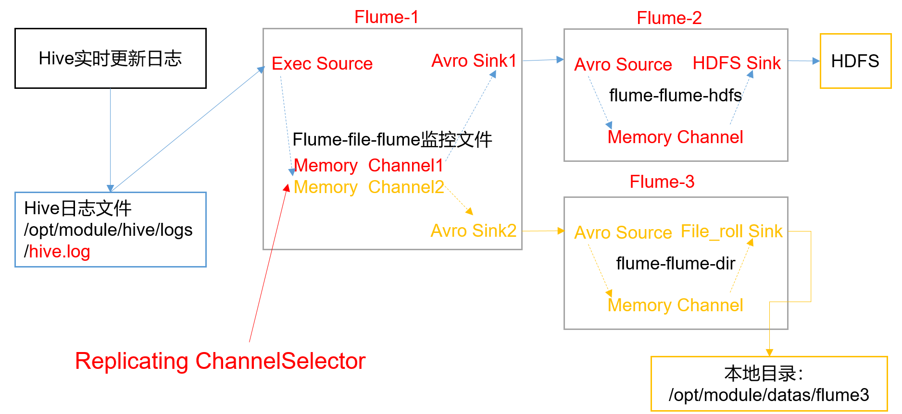

## Flume使用示例


#### 1.监控端口数据官方案例

[flume-netcat-logger.conf](conf/flume-netcat-logger.conf)

启动命令
```
bin/flume-ng agent \
-n a1 \
-c /usr/local/flume/conf/ \
-f /home/appuser/forlearn/flumejob/flume-netcat-logger.conf \
-Dflume.root.logger=DEBUG,console
```


#### 2.实时读取本地文件到HDFS
> 使用exec source来执行 tail -f

前提条件：需要能够写数据到HDFS，因此需要hadoop的jar包，需要把以下的jar包放到flume的lib下，如果集群已经安装好了hadoop，那就不需要
```
commons-configuration-1.6.jar
hadoop-auth-2.7.2.jar
hadoop-common-2.7.2.jar
hadoop-hdfs-2.7.2.jar
commons-io-2.4.jar
htrace-core-3.1.0-incubating.jar
```

[flume-file-hdfs.conf](conf/flume-file-hdfs.conf)

启动命令：
```
bin/flume-ng agent \
-c conf \
-n a2 \
-f /home/appuser/forlearn/flumejob/flume-file-hdfs.conf \
-Dflume.root.logger=DEBUG,console
```
> 让Flume存到HDFS的时候自动存为分区
> hdfs://hadoop101:8020/forlearn/flume/%Y%m%d/%H
> 要支持这种形式，需要在Event的header中有Timestamp，所以需要配置：
> hdfs.useLocalTimeStamp = true 

#### 3. 实时读取整个目录下的文件到HDFS
> 使用 spooldir source

[flume-dir-hdfs.conf](conf/flume-dir-hdfs.conf)

启动第3个agent：使用tail -f 不够稳定，严重依赖tail命令。改为：监控特定目录收集日志
```
bin/flume-ng agent \
-c conf \
-n a3 \
-f /home/appuser/forlearn/flumejob/flume-dir-hdfs.conf \
-Dflume.root.logger=DEBUG,console
```

#### 4. 使用taildir来实时监控目录下多个文件

[flume-taildir-hdfs.conf](conf/flume-taildir-hdfs.conf)

```
bin/flume-ng agent \
-c conf \
-n a3 \
-f /home/appuser/forlearn/flumejob/flume-taildir-hdfs.conf \
-Dflume.root.logger=DEBUG,console
```

#### 5. 串联
监听hadoop101上面的44444端口，并通过AvroSink传到hadoop102的AvroSource，然后输出到控制台

配置如下：
- [flume-chuanlian-agent1.conf](conf/flume-chuanlian-agent1.conf)
- [flume-chuanlian-agent2.conf](conf/flume-chuanlian-agent2.conf)

启动命令（注意启动顺序）
```
# hadoop102上先启动avro source
bin/flume-ng agent \
-n agent2 \
-c /usr/local/flume/conf/ \
-f /home/appuser/forlearn/flumejob/flume-chuanlian-agent2.conf \
-Dflume.root.logger=DEBUG,console


# hadoop101再启动avro sink
bin/flume-ng agent \
-n agent1 \
-c /usr/local/flume/conf/ \
-f /home/appuser/forlearn/flumejob/flume-chuanlian-agent1.conf \
-Dflume.root.logger=DEBUG,console
```

#### 6.单数据源多出口案例（选择器）



- agent1监控日志，将信息复制给agent2和agent3：[flume-selector-replicating-agent1.conf](flume-selector-replicating-agent1.conf)
- agent2负责从avro中读取信息，然后写入hdfs：[flume-selector-replicating-agent2.conf](flume-selector-replicating-agent2.conf)
- agent3负责从avro中读取信息，然后写入本地文件：[flume-selector-replicating-agent3.conf](flume-selector-replicating-agent3.conf)

启动命令
```
# 在hadoop102上启动agent2和agent3
bin/flume-ng agent \
-n agent2 \
-c /usr/local/flume/conf/ \
-f /home/appuser/forlearn/flumejob/flume-selector-replicating-agent2.conf \
-Dflume.root.logger=DEBUG,console

bin/flume-ng agent \
-n agent3 \
-c /usr/local/flume/conf/ \
-f /home/appuser/forlearn/flumejob/flume-selector-replicating-agent3.conf \
-Dflume.root.logger=DEBUG,console

# 在hadoop101上启动agent1
bin/flume-ng agent \
-n agent1 \
-c /usr/local/flume/conf/ \
-f /home/appuser/forlearn/flumejob/flume-selector-replicating-agent1.conf \
-Dflume.root.logger=DEBUG,console
```
结果在hadoop102的/home/appuser/forlearn/flumejob/selector目录下可以看到如下文件：
```
[appuser@hadoop102 selector]$ pwd
/home/appuser/forlearn/flumejob/selector
[appuser@hadoop102 selector]$ ll
total 72
-rw-rw-r-- 1 appuser appuser   862 May 29 23:35 1622302484716-1
-rw-rw-r-- 1 appuser appuser     0 May 29 23:35 1622302484716-2
-rw-rw-r-- 1 appuser appuser  6419 May 29 23:35 1622302484716-3
-rw-rw-r-- 1 appuser appuser     0 May 29 23:36 1622302484716-4
-rw-rw-r-- 1 appuser appuser     0 May 29 23:36 1622302484716-5
-rw-rw-r-- 1 appuser appuser     0 May 29 23:37 1622302634781-1
```