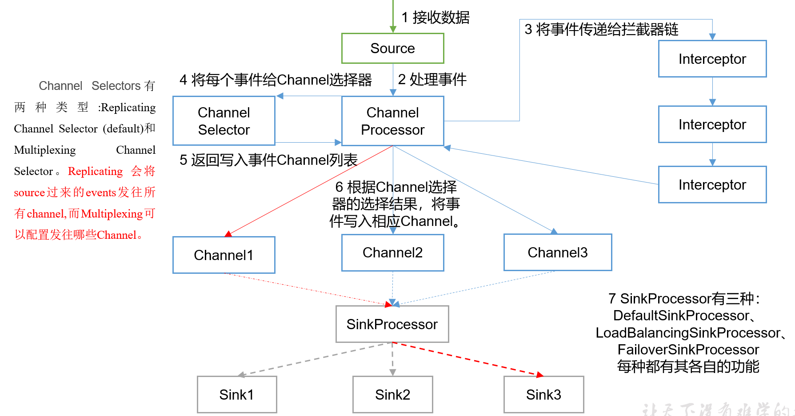
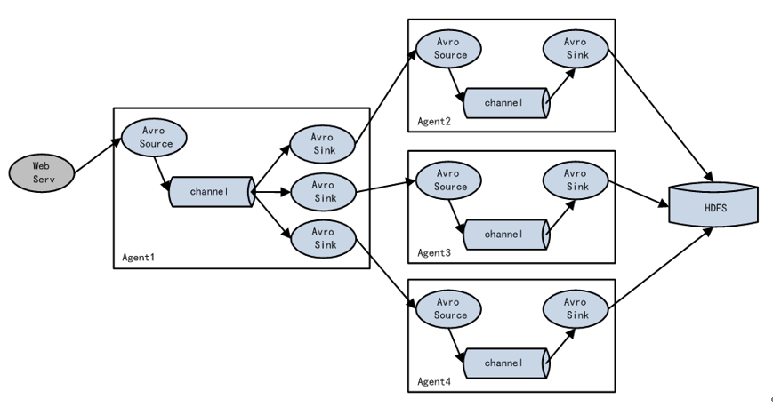

## Flume
flume各发行版本和文档: [http://flume.apache.org/releases/index.html](http://flume.apache.org/releases/index.html)

Flume是Cloudera提供的一个高可用的，高可靠的，分布式的海量日志采集、聚合和传输的系统。Flume基于**流式架构**，灵活简单

优点：
- 可以和任何存储进程集成
- 有缓存功能，在输出速率小于输入速率时会进行缓存
- 事务基于channel，确保消息被可靠传送（并不是exactly once，可能会重复）


### 1.Flume基础架构


- Flume-ng只有一个agent的节点
- Agent：Agent是一个JVM进程，它以事件的形式将数据从源头送至目的
- Source：负责接收数据到Flume Agent的组件
    - 可以处理各种类型、各种格式的日志数据，包括**avro**、thrift、**exec**、jms、**spooling directory、netcat**、sequence generator、syslog、http、legacy
- Channel。Flume自带两种Channel：Memory Channel和File Channel
    - Memory Channel是内存中的队列。Memory Channel在不需要关心数据丢失的情景下适用
    - File Channel将所有事件写到磁盘
- Sink
    - Sink不断地轮询Channel中的事件且批量地移除它们，并将这些事件批量写入到存储或索引系统、或者被发送到另一个Flume Agent
    - Sink组件目的地包括**hdfs、logger、avro**、thrift、ipc、**file、HBase**、solr、自定义
- Events
    - Event是Flume数据传输的基本单元
    - 以事件的形式将数据从源头传输到最终目的地
    - Event由Header和Body两部分组成。
        - Header用来存放该event的一些属性，为K-V结构
        - Body用来存放该条数据，形式为字节数组
- Interceptors 拦截器
    - 允许使用拦截器对传输中的event进行拦截和处理
    - Flume同时支持拦截器链，即由多个拦截器组合而成
- Channel Selectors 选择器，有replicating（默认）和multiplexing两种类型
    - replicating负责将event复制到多个channel
    - multiplexing则根据event的属性和配置的参数进行匹配，匹配成功则发送到指定的channel
- Sink Processors
    - 用户可以将多个sink组成一个整体（sink组）
    - Sink Processors可用于提供组内的所有sink的负载平衡功能，或在时间故障的情况下实现从一个sink到另一个sink的故障转移

常用：
```
Usage: bin/flume-ng <command> [options]...

global options:
  --conf,-c <conf>          use configs in <conf> directory # flume自身的相关配置
  -Dproperty=value          sets a Java system property value
  
agent options:
  --name,-n <name>          the name of this agent (required)
  --conf-file,-f <file>     specify a config file (required if -z missing) # agent的配置
  --zkConnString,-z <str>   specify the ZooKeeper connection to use (required if -f missing)
  --zkBasePath,-p <path>    specify the base path in ZooKeeper for agent configs
```

### 2.常用Source
#### 2.1 Avro Source
Avro Source通过监听Avro端口接收外部Avro客户端流事件（event）
> 支持Avro协议，接收RPC事件请求

关键参数：
- type：类型名称avro。
- bind：绑定的IP。
- port：监听的端口。
- threads:（重要）接收请求的线程数。
> 当需要接收多个avro客户端的数据流时要设置合适的线程数，否则会造成avro客户端数据流积压

#### 2.2 Kafka Source

#### 2.3 Exec
Exec source适用于监控一个实时追加的文件，但不能保证数据不丢失


#### 2.4 spooldir
Spooldir Source能够保证数据不丢失，且能够实现断点续传，但延迟较高，不能实时监控

缺点是不支持老文件新增数据的收集，并且不能够对嵌套文件夹递归监听

#### 2.5 taildir
Taildir Source维护了一个json格式的position File，其会定期的往position File中更新每个文件读取到的最新的位置，因此能够实现断点续传

和exec以及spooldir相比，Taildir Source既能够实现断点续传，又可以保证数据不丢失，还能够进行实时监控

#### 2.6 file_roll
将event存储到本地文件系统

### 3. Flume进阶
#### 3.1 Flume事务


各配置的数量关系
- batchSize：source和sink都可以配置这个参数
    - 对于source来说是一次性发往channel的event数量（存在channel的putList容器中）
    - 对于sink来说则是每次从channel批量取出多少到sink（从channel的takeList容器从取）
- transactionCapacity：配置putList和takeList的大小，也就是一次事务提交的量
- capacity：配置的是channel中存储event的容量，doCommit()发往的目的地
> 关系：batchSize <= transactionCapacity <= capacity
```
a1.channels.c1.type = memory    # 表示channel类型是memory内存型
a1.channels.c1.capacity = 10000 # 表示总容量是10000个event
a1.channels.c1.transactionCapacity = 1000 # 表示收到1000个event的时候再去提交事务
```

#### 3.2 Flume Agent内部原理


ChannelSelector：作用就是选出Event将要被发往哪个Channel
- Replicating（复制）：将同一个Event发往所有的Channel
- Multiplexing（多路复用）：根据相应的原则，将不同的Event发往不同的Channel

SinkProcessor共有三种类型，分别是：
- DefaultSinkProcessor：对应的是单个的Sink
- LoadBalancingSinkProcessor：对应的是Sink Group，实现负载均衡功能
- FailoverSinkProcessor：对应的是Sink Group，实现故障转移功能


#### 3.3 Flume拓扑结构
##### 3.3.1 简单串联
> 此模式不建议桥接过多的flume数量， flume数量过多不仅会影响传输速率，而且一旦传输过程中某个节点flume宕机，会影响整个传输系统


##### 3.3.2 复制和多路复用
使用的是```a1.sources.r1.selector.type```这个配置：默认是replicating，可以设置为multiplexing
- replicating：一个Source以复制的方式将一个Event同时写入到多个Channel中
- multiplexing：复用Channel选择器需要和拦截器配合使用，根据Event的头信息中不同键值数据来判断Event应该被写入哪个Channel中

selector.optional：定义可选Channel，多个可选Channel之间用空格隔开
> 可选的channel发生异常是，不会抛出。而必选的channel发生异常时会中断传输，抛出异常


##### 3.3.3 负载均衡和故障转移
Flume为了进一步提高整个系统的容错能力和稳定性，提供了负载均衡和故障转移功能

实现这两个功能首先需要设置Sink组，同一个Sink组内有多个子Sink，不同的Sink之间可以配置成负载均衡或者故障转移



负载均衡：
- processor.type：设置负载均衡类型 load_balance
- processor.backoff：在负载均衡的情况下需要将值设置为true，如果在系统运行过程中执行的Sink失败，会将失败的Sink放进黑名单中，为黑名单中的Sink设置驻留时间，黑名单中的Sink将不会再继续接收数据。当驻留时间超时，黑名单中的sink仍然无法提供服务，为了防止长时间等待黑名单中的Sink造成阻塞影响系统正常运行，黑名单驻留时间将以指数倍增加，默认值false。
- processor.selector.maxTimeOut：失败sink在黑名单中的驻留时间，默认值为30000ms。
- processor.selector：负载均衡选择算法，可以使用轮询“round_robin”、随机“random”或者继承AbstractSinkSelector类的自定义负载均衡实现类。

故障转移：
- processor.type：设置故障转移类型“failover”。
- processor.priority.<sinkName>：指定Sink组内各子Sink的优先级别，优先级从高到低，数值越大优先级越高。
- processor.maxpenalty：等待失败的Sink恢复的最长时间，默认值30000毫秒。

##### 3.3.4 多数据源融合
