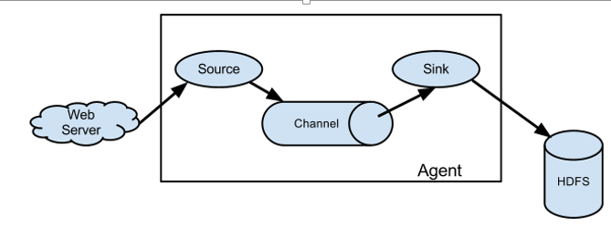

## Flume
flume各发行版本和文档: [http://flume.apache.org/releases/index.html](http://flume.apache.org/releases/index.html)

#### Flume基础架构


- Flume-ng只有一个agent的节点
- Agent：Agent是一个JVM进程，它以事件的形式将数据从源头送至目的
- Source：负责接收数据到Flume Agent的组件
    - 可以处理各种类型、各种格式的日志数据，包括**avro**、thrift、**exec**、jms、**spooling directory、netcat**、sequence generator、syslog、http、legacy
- Channel。Flume自带两种Channel：Memory Channel和File Channel
    - Memory Channel是内存中的队列。Memory Channel在不需要关心数据丢失的情景下适用
    - File Channel将所有事件写到磁盘
- Sink
    - Sink不断地轮询Channel中的事件且批量地移除它们，并将这些事件批量写入到存储或索引系统、或者被发送到另一个Flume Agent
    - Sink组件目的地包括**hdfs、logger、avro**、thrift、ipc、**file、HBase**、solr、自定义
- Events
    - Event是Flume数据传输的基本单元
    - 以事件的形式将数据从源头传输到最终目的地
    - Event由Header和Body两部分组成。
        - Header用来存放该event的一些属性，为K-V结构
        - Body用来存放该条数据，形式为字节数组
- Interceptors 拦截器
    - 允许使用拦截器对传输中的event进行拦截和处理
    - Flume同时支持拦截器链，即由多个拦截器组合而成
- Channel Selectors 选择器，有replicating（默认）和multiplexing两种类型
    - replicating负责将event复制到多个channel
    - multiplexing则根据event的属性和配置的参数进行匹配，匹配成功则发送到指定的channel
- Sink Processors
    - 用户可以将多个sink组成一个整体（sink组）
    - Sink Processors可用于提供组内的所有sink的负载平衡功能，或在时间故障的情况下实现从一个sink到另一个sink的故障转移

常用：
```
Usage: bin/flume-ng <command> [options]...

global options:
  --conf,-c <conf>          use configs in <conf> directory # flume自身的相关配置
  -Dproperty=value          sets a Java system property value
  
agent options:
  --name,-n <name>          the name of this agent (required)
  --conf-file,-f <file>     specify a config file (required if -z missing) # agent的配置
  --zkConnString,-z <str>   specify the ZooKeeper connection to use (required if -f missing)
  --zkBasePath,-p <path>    specify the base path in ZooKeeper for agent configs
```


