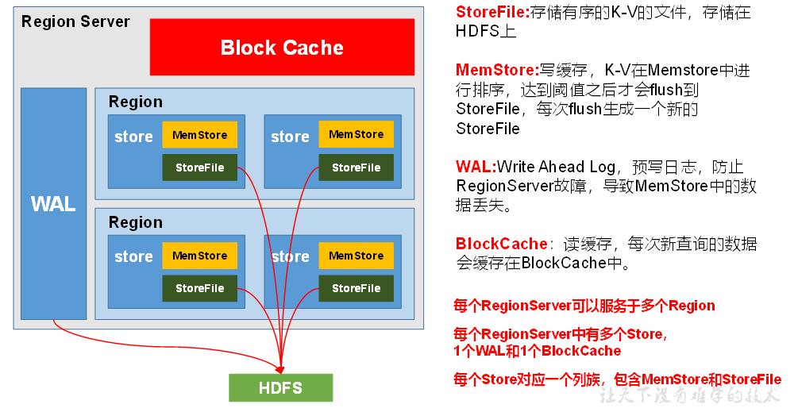
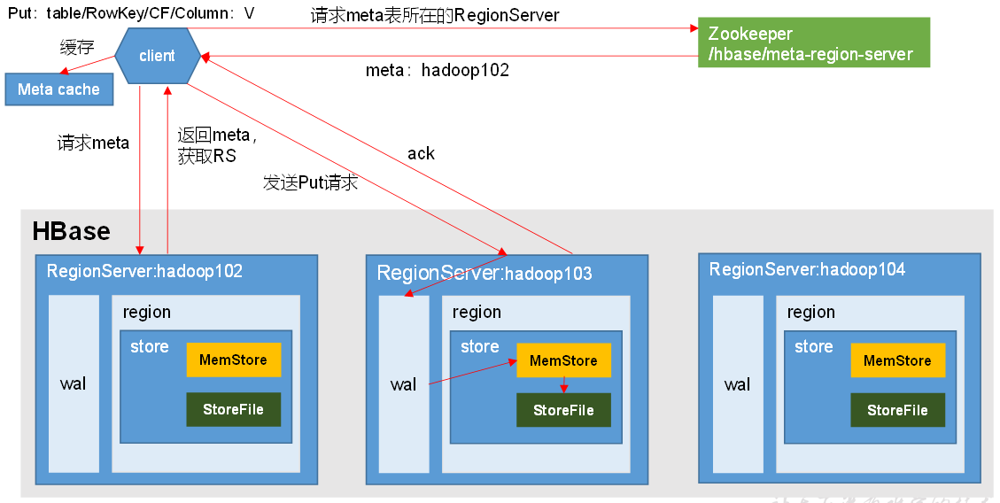
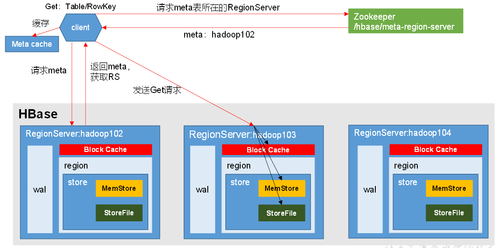
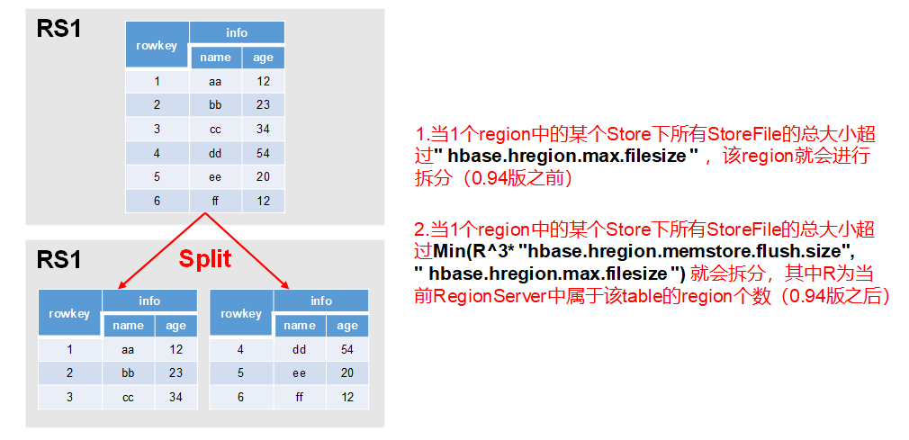

## HBase进阶

#### 1.RegionServer 架构


> WAL也是存在HDFS上的

查看HFile的命令
```
bin/hbase org.apache.hadoop.hbase.io.hfile.HFile -p -f hdfs://hadoop101:8020/hbase/data/库名/表名/Region名/列族名/HFile文件名
例如：
bin/hbase org.apache.hadoop.hbase.io.hfile.HFile -p -f hdfs://hadoop101:8020/hbase/data/default/student/1a306733d6aae21dd75e7c84d867ae2d/info/f0c0115f486c4297815c8ed011b66c72
```

#### 2.写流程


#### 3.读流程


> 第4步：分别在Block Cache（读缓存），MemStore和Store File（HFile）中查询目标数据，并将查到的所有数据进行合并。此处所有数据是指同一条数据的不同版本（time stamp）或者不同的类型（Put/Delete）

#### 4.MemStore Flush
MemStore存在的意义是在写入HDFS前，将其中的数据整理有序（排序）


MemStore刷写时机
- 当单个memstore的大小达到了
```
hbase.hregion.memstore.flush.size（默认值128M）
```
其所在region的所有memstore都会刷写。
- 当memstore的大小达到了
```
* hbase.hregion.memstore.flush.size（默认值128M）
* hbase.hregion.memstore.block.multiplier（默认值4）
```
时，会阻止继续往该memstore写数据。
- 当region server中memstore的总大小达到java_heapsize
```
hbase.regionserver.global.memstore.size（默认值0.4）
hbase.regionserver.global.memstore.size.lower.limit（默认值0.95）
```
region会按照其所有memstore的大小顺序（由大到小）依次进行刷写。直到region server中所有memstore的总大小减小到上述值以下。
- 当region server中memstore的总大小达到java_heapsize
```hbase.regionserver.global.memstore.size（默认值0.4）```
时，会阻止继续往所有的memstore写数据
- 到达自动刷写的时间，也会触发memstore flush。自动刷新的时间间隔由该属性进行配置
```
hbase.regionserver.optionalcacheflushinterval（默认1小时）
```
- 当WAL文件的数量超过hbase.regionserver.max.logs，region会按照时间顺序依次进行刷写，直到WAL文件数量减小到hbase.regionserver.max.log以下（该属性名已经废弃，现无需手动设置，最大值为32）。

#### 5.StoreFile Compaction

> 由于Hbase依赖HDFS存储，HDFS只支持追加写。所以，当新增一个单元格的时候，HBase在HDFS上新增一条数据。当修改一个单元格的时候，HBase在HDFS又新增一条数据，只是版本号比之前那个大（或者自定义）。当删除一个单元格的时候，HBase还是新增一条数据！只是这条数据没有value，类型为DELETE，也称为墓碑标记（Tombstone）
HBase每间隔一段时间都会进行一次合并（Compaction），合并的对象为HFile文件。合并分为两种
- minor compaction
> 会将临近的若干个较小的HFile合并成一个较大的HFile，但不会清理过期和删除的数据
- major compaction
> 把多个HFile合并成1个HFile，在这个过程中，一旦检测到有被打上墓碑标记的记录，在合并的过程中就忽略这条记录，也就会清理掉过期和删除的数据

#### 6.Region Split
默认情况下，每个Table起初只有一个Region，随着数据的不断写入，Region会自动进行拆分。刚拆分时，两个子Region都位于当前的Region Server，但处于负载均衡的考虑，HMaster有可能会将某个Region转移给其他的Region Server

HBase0.94版本之后的切分策略默认使用 IncreasingToUpperBoundRegionSplitPolicy 策略切分region，配置项是
```
hbase.regionserver.region.split.policy
```

Region Split时机


具体表现为：
- tableRegionsCount在0和100之间，则为
  	initialSize（默认为2*128） *  tableRegionsCount^3
```
例如：
  第一次split：1^3 * 256 = 256MB 
  第二次split：2^3 * 256 = 2048MB 
  第三次split：3^3 * 256 = 6912MB 
  第四次split：4^3 * 256 = 16384MB > 10GB
因此取较小的值10GB，后面每次split的size都是10GB了
```
- tableRegionsCount超过100个，则超过10GB才会切分region
