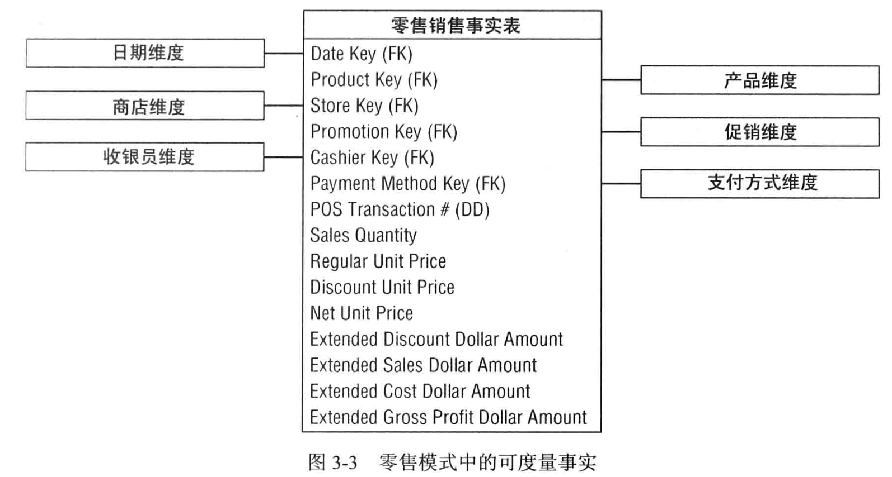

# 零售业务

## 3.1 维度模型设计的4步过程
### 第1步 选择业务过程
业务过程：组织完成的微观活动，有以下特征：
- 业务过程通常用行为动词表示
- 通常由某个操作型系统支撑，比如账单或购买系统
- 业务过程建立或获取关键性能度量。
  - 有时这些度量是业务过程的直接结果，有时从其他时间获得
- 业务过程通常由输入激活，产生输出度量
  - 可能包含一系列过程，可能即是某些过程的输入，也是某些过程的输出
  - 一系列过程产生一系列事实表

注意：
1. 业务人员可能难以回答跟建模相关的专业名词，比如“对何种业务过程感兴趣”
2. 业务用户可能谈的是业务战略规划，不是业务过程。需要在调研的过程中将业务规划拆解到基本业务过程中
> 战略规划：管理层为提高竞争优势而制定的抽象企业规划
3. 业务部门或企业功能职责不等于业务过程

### 第2步 声明粒度
粒度：
- 粒度传递的是更事实度量有关的细节级别，回答“如何描述事实表中每一行的内容？”这个问题
- 粒度由获取业务过程事件的操作型系统的物理实现确定。
- 最终的粒度和主键是等价的。

典型的粒度声明（以业务术语表示粒度）：
- 客户销售事务上的每个产品扫描到一行中
- 医生开具的票据的列表内容项采用一行表示
- 机场登机又处理的每个登机牌采用一行表示
- 仓库中每种材料库存水平的每日快照采用一行表示每个银行账户每月的情况采用一行表示

注意：
- 声明粒度会被很多人误以为是可有可无的步骤，但却是不容忽视的关键步骤，设计组的每个人都需要对事实表粒度达成共识
- 设计之初没有声明粒度，整个设计就像建在流沙智商，对候选维度的讨论处于兜圈子的状态，不恰当的事实将隐藏在设计中，不适当的维度也会始终笼罩DW/BI实现

### 第3步 确定维度

要解决的问题：“业务人员如何描述来自业务过程度量事件的数据？”
- 使用健壮的维度集合来装饰事实表
- 维度表示承担每个度量环境中所有可能的单值描述符

注意：
- 选择每个维度时，应该罗列出所有具体的、文本类型的属性以充实每个维度表
> 设备维度，所有的属性有：设备版本、设备操作系统、设备型号、设备价格等等。也就是说，要把维度的所有字段考虑全

### 第4步 确定事实

通过回答“过程的度量是什么”这一问题来确定事实，商业用户非常愿意分析这些性能度量

注意：
- 所有候选事实都需要符合第2步定义的粒度，明显不停粒度的实施必须放在不同的事实表中
- 需要综合考虑业务用户需求和数据来源的实际情况，并与4个步骤联系
- 不能只考虑数据来源来建模数据，数据不能替代业务用户的输入（虽然可能不会像与商业用户交流那样复杂）
> 很多组织仍在采用这种看似最省力的数据驱动方法，但基本不会成功

## 3.2 零售业务案例研究
业务信息：
- 产品统一编号（SKU）
- 最常见的数据来源于收银台产生的交易信息
- 零售商店，管理方便主要关心对订单、库存、销售的组织工作，目的是实现利润最大化
- 利润来源：每种商品尽可能多的差价，降低获得产品的成本、提供具有较强竞争力的环境吸引更多顾客消费
- 管理决策和价格、促销有关

### 第1步 选择业务过程
对业务需求以及可用数据源来综合考虑：
- 第一个DW/BI项目应该将注意力放在最关键、最易实现的业务过程上
- 最易实现涉及一系列考虑：数据可用性与质量，组织的准备工作等

零售业务中，管理层最希望知道的是理解通过POS系统获得客户购买情况

### 第2步 声明粒度
确定完业务过程，设计组需要面临一系列有关粒度的决策

实践来看：
1. 有许多理由要求以最低的原子粒度处理数据。
   1. 原子粒度具有强大的多维性，原子数据能与多维方法实现最佳匹配。
   2. 事实度量越详细，越能获得更确定的事实
   3. 将所知道的所有确定的事情转成维度
   4. 原子数据可被约束，并以某种可能的方式上卷
   5. 可适应商业用户比较随意的查询请求
2. 也可以定义汇总粒度来表示对原子数据的聚集
   1. 好处：对性能调整有很好的效果
   2. 不足：限制了查询的颗粒度，无法满足用户下钻细节的需求
   

注意：
- 涉及开发的维度模型应该能表示出由业务过程产生的最详细的原子信息
- DW/BI系统几乎总是要求数据尽可能用最细粒度来表示，不是因为需要查询单独的某行，而是需要以非常精确的方式对**细节进行切分**。

### 第3步 确定维度
详细的粒度说明确定了事实表的主要维度。
> 本案例中，主要维度是销售的产品，购买者。只有这个维度的存在，交易事件才能发生。

在主维度框架内，可以考虑其他维度是否可以被属性化为POS度量。
比如：
- 本案例中的：销售日期、销售商店、是否被促销、收款员、支付方式等
- POS交易票据数量作为一个特殊维度也需要包含在其中

注意：
- 额外的维度需要能自然地承担主要维度合并的某个值
  
  > 简单理解：附加维度在主要维度上只能赋唯一一个值，比如这里的产品ID、购买者ID为主要维度，那么加上购买日期时只能有一个具体的日期值
- 如果附加的维度会产生于粒度不符的其他事实行，则取消该维度或出现考虑粒度声明

在使用描述性属性填充维度表之前，需要完成第4步。

### 第4步 确定事实
设计的最后 一步是确认应该将哪些事实放到事实表中。粒度声明有助于稳定相关的考 虑。事实必须与粒度吻合。

零售业务事实一般有：
- POS系统收集的事实包括销售数量(例如，鸡汤面的听数)、单价、折扣、净支付价格、 扩展折扣、美元销售额等
- 扩展的美元销售额等于销售数量乘以净单位价格。同样地，扩展的销售折扣额等于销售数量乘以单位折扣额
- 如果成本事实随时可用且不需要记述详细的基于活动的成本来源，则可以将成本额这个扩展字段包含在事实表中
> 如果成本是基于活动/时间来统计的，那么只能新建事实表，而不能包括在销售事实表中

事实表雏形：

销售数量、销售额、成本额、扩展销售额，均是完全可加型事实，可以按维度不受限制开展切片或切块操作

#### 计算获得的事实
总利润额（收入）=扩展销售额-扩展成本额
- 虽然是通过计算获得的，但总利润额也是完全可加的
- 是否应该将计算得到的事实写入数据库中？
  - 通常推荐将它们物理存储：意味着其计算和ETL过程保持一致性，消除了用户计算错误的可能性
  - 因为总利润额通过单一事实表行可以计算得到，有些人认为应该采取视图这种可以减少用户错误且节省存储的方法
    - 要求：数据库管理员要保证通过视图访问数据的方式不会产生意外

#### 不可加事实

利润率=总利润额/扩展销售额

- 利润率是不可加事实，不能从任何维度汇总
- 实践上，存储时要改将分子和分母分别存储在事实表中，由下游如BI工具计算比率

单价

- 也是不可加事实，对所有维度汇总单价会产生毫无意义的、荒谬的数字
- 是否应该物理存储不可加事实？
  - 典型的：报表中需要打印单独值，或直接在事实表应用过滤器
  - 某些情况下，基本的不可加事实（比如温度）是从其他源系统获得，这类事实需要通过多个记录求平均值获得。如果分析师要求使用，将这类事实存在事实表也是有意义的。

#### 事务事实表

这是最常见的业务过程。表示这些业务过程的事实表有以下特征：

- 原子事务事实表的粒度可在事务环境下被简洁地描述
- 由于这些事实表记录的是一个事务事件，所以它们通常比较稀疏。比如不可能将所有产品放到一个购物车中
- 即使事务表无法预测，发布稀疏，它们仍然可能非常庞大
- 事务事实表趋向成为多维化
- 只要通过数量来扩展而不是单位，事务事实返回的度量通常是可加的

在设计之初预估下事实表的行数是非常有必要的：
- 可以通过与源系统专家讨论，理解每个基本周期内产生多少事务行
- 比如可以用每年收入总额除以平均每项的销售价格，例如40亿/2元，得到大约20亿事务项
> 作为一个设计者，应该始终通过多角度测量来确定计算是否合理

### 3.3 维度表设计细节

如何为维度表设计健壮的属性的细节

#### 3.3.1 日期维度

这种一种特殊的维度
- 几乎出现在所有的维度模型中。实际上每个业务过程都需要获取时间序列的性能度量
- 日期通常也是数据库分区模式下首先需要考虑的维度
- 可以提前建立日期维度表

]

任何SQL查询都可以直接约束事实表中的日期键，为什么需要如何详尽的日期维度表？
- 如果关系数据库不能很有效处理与日期维度表的连接，处理会有大麻烦
- 多数数据库都能高效处理多维查询，对于日期维表的连接操作的成本没有那么昂贵
- 商业用户大都不熟悉SQL日期语义，难以实现典型的日历分组
- SQL日期函数不支持以特殊属性（比如工作日和节假日、财务周期等）进行过滤

注意：
- 日历逻辑应该由维度表解决，而不是由应用代码解决

##### 1.文本属性的标识和标志
日期维度的假日标识是一种简单的带有2个可能值的标识。

因为维表属性常用于报表和下拉式查询过滤列表中的值，所以该标识应该使用有意义的值，比如假日/非假日，而不是Y/N、1/0表示。

##### 2.当前与相对日期属性
大多数日期维度的属性不应该更新，某些属性可以随时间变化，比如isCurrentDay、isPrior60Days等，这类属性也可以增加到基本日期维度中

一些维度属性包含对滞后属性的更新，比如滞后日期列：0表示今天、-1表示昨天、1表示今天
- 这种属性易于成为可计算列而不是物理的存储
- 可用于为月、季度、年设计类似的结构
> 许多BI工具提供了类似的功能，所以这些滞后列可能没有存在的必要

##### 3.将当天时间（time-of-day）作为维度或事实
- 当天时间（time-of-day）应该从日期维表中分离出来
- 如果需要特征时间周期做汇总，比如15分钟间隔、小时、午餐时间，当天时间（time-of-day）将被视为完整维度表，以每个固定时间周期为一行

另外，商业用户通常对滞后时间更感兴趣，例如事务的持续时间，而不是离散的开始时间和结束时间
