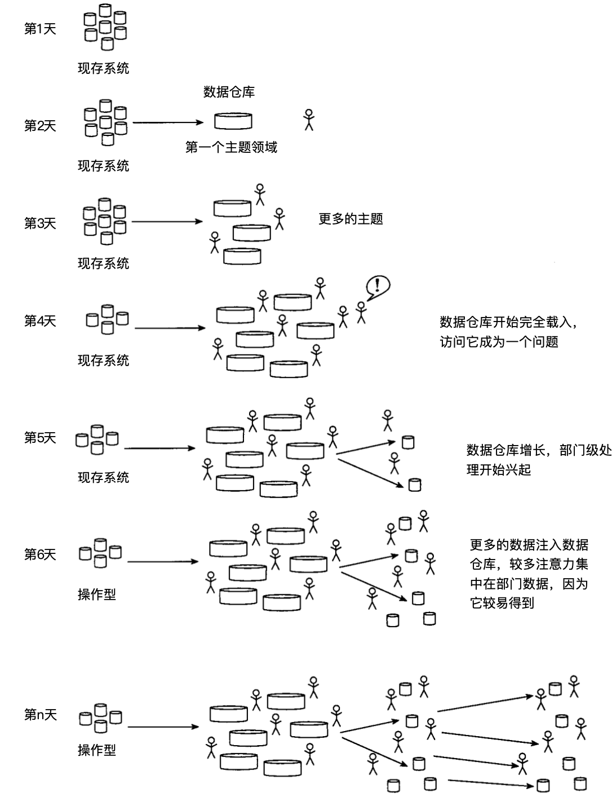

# 数据仓库第4版 Inmon
《Building the Data Warehouse》
## 第1章 决策支持系统的发展

## 第2章 数据仓库环境
数据仓库是一个面向主题的、集成的、非易失（相对稳定）的且随时间变化（反映历史变化）的数据集合，用来支持管理人员的决策
- 主题的
- 集成的：数仓最重要的特性
  - 当数据进入数仓时，要采取某种方法消除应用问题中的不一致性（比如命名习惯、键码结构、属性度量以及数据特点等）
  - 【集成的意思还包括将多个业务系统的数据整合在一起】

- 非易失
  - 操作性环境中的数据可以进行更新，数仓的数据通常是一起载入与访问的，也不进行一般意义上的数据更新

- 随时间变化的
  - 
  - 一系列某一时刻生成的复杂快照
  - 数仓的键码结构总是包含时间元素（换句话说，一般都有ETL时间、所存数据的时间范围等）

### 2.1 数据仓库的结构

这里的结构，其实就是常说的分层。
- 早期细节级：ODS层
- 当前细节级：DWD层
- 轻度综合级（数据集市）：DWS层/DWM层
- 高度综合级：ADS层/APP层

一旦数据过期，就由当前细节级进入早期细节级。综合后的数据由当前细节级进入轻度综合数据级，然后由轻度综合数据级进入高度综合数据级

### 2.2 面向主题
**主题域**：数据仓库是面向在数据模型中已定义好的公司的主要主题领域的。主要主题领域是以一组相关的表来具体实现的，如下图所示：

> 示图中每张表所存的数据的时间都不一样，很好的体现了随时间变化的特点。只是，这里新增了字段就新建了一张表

特征：
- 属于相同主题域的数据集合由一个公共键码联系起来（比如custom_id)
- 主题域中的数据可以存储在不同的介质上
  - 访问概率高且存储空间小的数据存放在快速且相对昂贵的存储介质上;访问概率低且存 储空间大的数据存放在廉价、慢速的存储介质上
  - 在大数据场景下，进一步演变为了热集群、冷集群，冷热数据
- 数据既有综合级，又有细节级
- 当数据围绕顾客这个主题组织时，每个键码都有一个时间元素， 如下图

### 2.3 第1天到第n天的现象
建立数仓不是一蹴而就的，相反，数仓只能一次一步地进行设计和载入数据，是**进化性**的而非**革命性**的

- 第1天，通晓本质上进行操作型处理的几个系统
- 第2天，第一个主键建成，这个时候就会有一些用户有好奇心，开始有用户发现数仓，并开始尝试使用
- 第3天，更多的数据载入数仓，随着数据量增大，将吸引更多的用户。一旦用户发现有较容易载入的集成数据源，并有**在时间维上观察数据的历史基础**，认真的DSS分析员将被吸引到数仓
- 第4天，各式各样的DSS应用就出现了。逐渐，进入数仓的竞争成为了使用数仓的障碍。
- 第5天，部门级数据库（数据集市或OLAP）开始兴起。到达部门级的数据吸引这一批DSS分析员
- 第6天，部门系统出现繁忙，得到部门数据比数仓更便宜、快速、容易，很快用户会放弃数仓细节，转去部门处理
- 第n天，这种体系结构得到充分发展

当然，从第1天到第n天进化通常需要几年。

### 