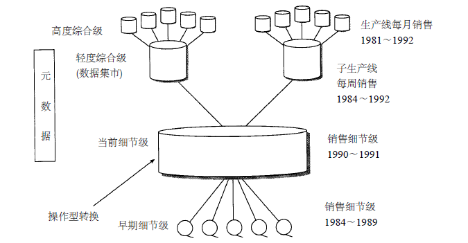

# 数据仓库第4版 Inmon
《Building the Data Warehouse》
## 第1章 决策支持系统的发展

## 第2章 数据仓库环境
数据仓库是一个面向主题的、集成的、非易失（相对稳定）的且随时间变化（反映历史变化）的数据集合，用来支持管理人员的决策
- 主题的
- 集成的：数仓最重要的特性
  - 当数据进入数仓时，要采取某种方法消除应用问题中的不一致性（比如命名习惯、键码结构、属性度量以及数据特点等）
  - 【集成的意思还包括将多个业务系统的数据整合在一起】

- 非易失
  - 操作性环境中的数据可以进行更新，数仓的数据通常是一起载入与访问的，也不进行一般意义上的数据更新

- 随时间变化的
  - 
  - 一系列某一时刻生成的复杂快照
  - 数仓的键码结构总是包含时间元素（换句话说，一般都有ETL时间、所存数据的时间范围等）

### 2.1 数据仓库的结构

这里的结构，其实就是常说的分层。
- 早期细节级：ODS层
- 当前细节级：DWD层
- 轻度综合级（数据集市）：DWS层/DWM层
- 高度综合级：ADS层/APP层

一旦数据过期，就由当前细节级进入早期细节级。综合后的数据由当前细节级进入轻度综合数据级，然后由轻度综合数据级进入高度综合数据级

### 2.2 面向主题
**主题域**：数据仓库是面向在数据模型中已定义好的公司的主要主题领域的。主要主题领域是以一组相关的表来具体实现的，如下图所示：

> 

### 2.3 第1天到第n天的现象