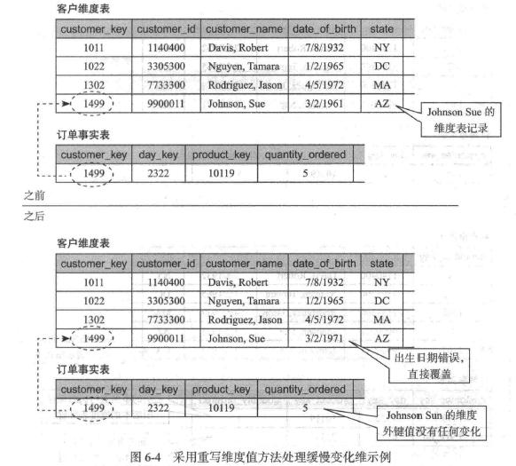
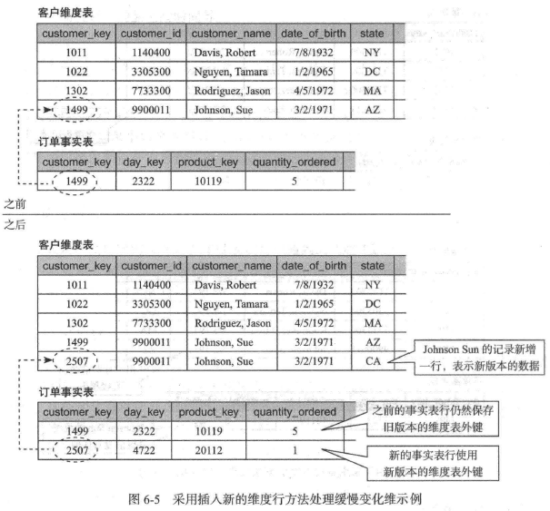
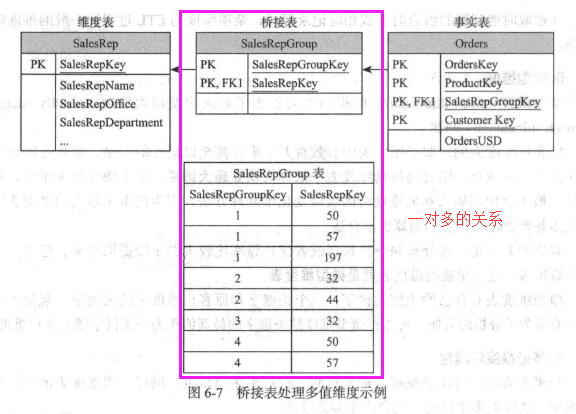
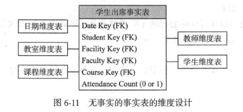

## 维度数据模型（《离线和实时大数据开发实战》）

维度模型是一种趋向于支持最终用户对数据仓库进行查询的设计技术，是围绕性能和易理解性构建的。有两种模式：星型模型、雪花模型
> 关系模型对于事务处理系统表现非常出色，但它并不是面向最终用户的

几个重要的概念
- 度量和环境：是构成维度建模的基础，脱离环境上下文来讨论度量是没有意义的。比如店铺上个月的销量。销量就是度量，店铺上个月就是环境
- 事实和维度：在建模理论中，度量就是事实，环境就是维度

事实和维度是两个维度模型中的核心概念
- 事实表是维度建模的基本表、核心表，一行对应一个度量事件
    - 事实通常是数字类型的，可以进行聚合和计算
    - 除了存储事实外，还会包含多个相关的外键/代理键
- 维度表是维度建模的灵魂，是事实表的入口，除了5个W还包含了很多描述字段和标签字段
    - 事实表示对业务数据的度量，而维度是观察数据的角度。
    - 维度通常是一组层次关系或描述信息，用来定义事实
    - 维度表的属性：也就是维度表的列
        - 是查询约束条件(Where)、分组(group)与报表标签生成的基本来源(经常用by来标识)
        - 属性的好坏是数仓易学易用的关键，可以说数仓是维度属性的体现而已，数仓能力直接与维度属性的质量和深度成正比
        - 提高质量的三大方面：提供详细的业务用语属性、思考该给定属性的列值、保证属性列值的质量
        - 最好的属性是文本型、分散型的
    - 丰富的维度属性可以给予了丰富的分析切割能力
- 区分字段是事实还是维度：含有许多取值并参与运行的是事实，变化不多并作为约束条件的是维度
    
> 销售金额是一个事实，而销售时间、销售的产品、购买的顾客、商店等都是销售事实的维度

> 5个W：谁(Who)什么时候(When)在什么地方(Where)为什么(why)做了一件什么事情(What)

### 1.维度数据模型建模过程
- 选择业务流程
    - 确保数据一致性的最佳办法就是从企业和公司全局与整体角度，对某一个业务过程建立单一的、一致的维度模型
- 声明粒度
    - 在选择维度和事实之前，必须先声明粒度，每个候选维度或事实必须与定义的粒度保持一致（不能把不同粒度的事实建立在同一张表中）
    - 在一个事实所对应的所有维度设计中强制实行粒度一致性是保证数仓性能和易用性的关键
    - 一般会从原始粒度（最低级别的粒度）开始设计
- 确认维度
    - 维度表是事实的基础，说明了事实表的数据从哪里来
    - 典型的维度都是名词，如日期、商店、库存等
    - 维度表存储了某一维度的所有相关的数据
- 确认事实
    - 识别数字化的度量，构成事实表的记录
    - 和用户最相关，用户通过对事实表的访问获取数仓的数据
    - 大部分是数字类型，可累加、可计算
    
### 2. 维度数据模型的特点
- 易理解
- 高性能
    - 维度模型更倾向于非规范化，可以优化查询的性能（范化的实质是减少数据冗余，以优化事务处理或数据更新的性能）
    - 维度设计的整体观点是要简化和加速查询
- 可拓展
    - 维度模型允许数据冗余，更容易容纳不可预料的新增数据

### 3. 星型模式
星型模式将业务流程分为事实和维度。事实包含业务的度量，是定量的数据，如销售价格、销售数量、距离、速度、重量等是事实。维度是对事实数据属性的描述，如日期、产品、客户、地理位置等是维度

#### 3.1 事实表
一般由数字值和指向维度表的外键组成，一般会把事实表的粒度级别设计得比较低

主要有三种类型的事实表
- 事务事实表：记录特定事件的事实，如销售
- 快照事实表：记录给定时间点的事实，比如月底账户余额、库存，一般是半可加的
- 累积事实表：记录给定时间点的**聚合事实**，如当月总销售额。非常实用具有工作流或者流水线形式业务的分析，是从全流程的角度对业务状态的拍照。比如保险公司理赔过程
> - 无事实的事实表：没有度量和事实的表，比如学生课程出席情况、用户网站流量行为、客户对广告的点击行为等，一般会认为增加一个常数列（列值总为1）方便对业务时间的统计
> - 汇总的事实表：也就是对事实表预先进行聚合和汇总

#### 3.2 维度表
维度表的记录数通常比事实表少，但每条记录包含有大量用于描述事实数据的属性字段（存在冗余：比如某个商品的品牌被重复存储了多次）

每个维度都是均等的，所有维度表都是进入事实表的对等入口，用户可以从任意维度、任意维度属性或多个维度及属性组合对数据进行操作

常用的维度表：
- 时间维度表。
- 地理维度表。描述位置信息的数据，如国家、省份、城市、区县、邮编等。
- 产品维度表
- 人员维度表
- 范围维度表。描述分段数据的信息，如高级、中级、低级等。

通常，维度表会设计一个数字类型的代理键，映射业务数据中的主键

#### 3.3 优点
星型模式是非规范化的，不受应用于事务型关系数据库的范式规则的约束，优点有：
- 简化查询。查询数据时，星型模式的连接逻辑比较简单，而从高度规范化的事务模型查询数据时，往往需要更多的表连接。
- 简化业务报表逻辑。与高度规范化的模式相比，由于查询更简单，因此星型模式简化了普通的业务报表（如每月报表）逻辑。
- 获得查询性能。星型模式可以提升只读报表类应用的性能。
- 快速聚合。基于星型模式的简单查询能够提高聚合操作的性能。
- 便于向立方体提供数据。星型模式被广泛用于高效地建立OLAP立方体，几乎所有的OLAP系统都提供ROLAP模型（关系型OLAP），它可以直接将星型模式中的数据当作数据源，而不用单独建立立方体结构。

#### 3.4 缺点
- 不能保证数据的完整性。一次性地插入或更新操作可能会造成数据异常（在范式规则约束下的关系模型可以避免）
- 对分析需求来说，不够灵活。很难进行全面的数据分析，不能自然的支持业务数据多对多的关系，需要维度表和事实表之间建立桥接表

#### 3.5 维度表的设计
维度变化、维度层次、维度一致性、维度整合与拆分直接关系到维度建模的好坏
- 维度变化
    - 缓慢变化维：数据的缓慢变化。确定源头数据变化在维度表中如何表示非常重要。
    - 几种处理方法
        - 1)重写维度值：适用于不需要保留该维度属性历史变化的情况，常用语错误修订或者属性改变无关紧要的尝尽。比如用户输错生日。改变时需要**通知下游分析用户**
        
        
        - 2)插入新的维度行：虽然保留维度变化信息，但是为维度表的用户带来了困惑，用户的使用和学习成本增加，开发人员对维度变化的处理逻辑也更为复杂
        
        
        - 3)插入新的维度列：比如上一次所属大区，当前所属大区，通过这两个字段来记录维度的变化，如果变化多次就需要增加多个列，不希望增加那么多就只能保留最近比如2次的变化
        
        

- 维度层次
    - 指维度表中属性之间的层次关系，比如化妆品可分为男士、女士，男士化妆品下又有不同的子品牌，每个子品牌又有不同的产品
    - 两种处理方法
        - 把所有维度层次结构扁平化，比如一级到三级类目分别用三个字段来存储（一般用这种方法）
        - 采用雪花模型，也就是用类目id来代替类目，然后维护一张类目表
    - 维度的层次结构通常和钻取联系在一起：向上钻取，向下钻取
- 维度一致性
    > 数据集市：逻辑上划分的，一般由一张和多张紧密联系的事实表级维度表组成，一般是部门级或者面向某个特定主题。数据仓库则是企业级、面向主题、集成的数据集合
    - 指：两个维度如果有关系，要么就是完全一样，要么一个维度是另一个维度的子集，这也是保持维度一直性的主要思路
    - 不一致包括维度表内容的不一致，也包含维度属性上的不一致（不一致会造成数据集市孤立无法集成为数仓）
        - 比如：浏览域采用的是昨天的类目，而成交采用的是后台类目，那么对类目和时间的交叉分析就无法进行
        - 比如：统计浏览-成交转化率，某些类目在浏览域存在在交易域不存在，那么也无法计算
    - 跨主题域在维度建模中成为**横向钻取**
    - 维度一致性对于数据集市集成为数据仓库起着关键的作用
- 维度整合
    - 可能会出现同一个维度表来自多个业务系统的问题，比如：移动端和PC端交易系统的系统架构、底层数据库、数据表都不一致
    - 在考虑维度整合时要考虑：
        - 命名规范：确保一直和统一
        - 字段类型：统一这个为一个字段类型
        - 字段编码和含义：编码和含义整合为一致，比如A系统用Y/N表示商品状态，而B系统用0/1表示。
- 维度拆分
    - 比如中石油主业为成品油销售，但其加油站的零售店又有其他商品，这个时候，建立统一的商品维度表就不现实
    - 处理方法：
        - 先建立两个单独的维度表，再基于单独维度表生成共有的商品维度表或视图，比如基本维度表记录商品价格、描述等公有属性字段，一个单独维度表记录成品油标号(如92号汽油)等独特属性，另一个则记录零售商品的各种属性
        - 不合并，拆分。两个独立的维度表各自管理维护
    - 一般对于业务相似度比较大的才会采取第一种方法
- 维度其他
    - 退化维度：指事实表中看起来像维度的字段，通常可以用来对事实表进行分组，比如购物小票编号、事务编号
    - 行为维度：将事实转化为维度，也获取更多分析能力，比如用户的年购买额、年购买次数。行为维度会缓慢变化，需要用缓慢变化维处理
    - 角色维度：指一个事实表中多个外键指向同一个维度表。比如贷款表中，客户经理、审批专员都指向员工表
    - 杂项维度：一般由指示符和标志字段组合而成，比如支付类型包括现金和信用卡等，通常会建立杂项维度来处理，事实表中就只需要一个外键。TODO：实例？
        - 几个字段的不同取值组成一条记录，生成代理键，再把这个代理键作为外键存在事实表中
        - 建议不要使用所有组成生成完整的杂项维度表，遇到再新增即可
    - 微型维度
        - **快变超大维度**：比如客户维度如果有数百万、千万、亿的记录，而且字段经常变化的时候，这样的维度表就是快变超大维度，一般不会使用插入新维度行的缓慢变化维处理方式
        - 解决方法：将分析频率高或者变化频率大的字段提取出来，建立一个单独的维度表，也就是微型维度表
        - 微型维度表有自己的主键，一般和原客户维度表的主键一块存入事实表，也可以把主键作为最新值存在客户维度表中
    - 多值维度和属性
        - 多值维度：(1)当事实表的一行涉及维度表的多行时(2)当维度表的一行需要获取单一属性的多个值时，也会产生多值维度
        - 比如银行的联名账户，可以有第一账户拥有人、第二账户拥有人、第三账户拥有人
        - 解决方法：
            - 扁平化多值维度：将多个账户作为多个字段存在维度表中，比如第1、2、3账户拥有人三个字段（可增加预留字段：第4账户拥有人等）
            - 桥接标：在事实表和维度表之间新建一个桥接表，用来存来一对多的关系，如下图：

#### 3.6 深入事实表
需要关注不同事实表的建模过程。

无事实的事实表的维度设计:

#### 3.7 大数据的维度建模实践
Kimball经典维度建模理论很多概念和设计是基于当时的技术现状提出，在大数据时代并不十分适用，需要作相应的优化和改良

大数据的维度建模：
- 主要特点：(1)进一步反规范化和扁平化 (2)更简单、直接
- 目的：为了下游适用更为便捷、学习成本更低

事实表：
- 以存储的冗余为代价，换来使用的便捷和节省多次关联计算的开销：技术大数据时代，HDFS和MR等技术的发展，使得存储成本和性能不再是关键，可以进一步把常用的维度属性**沉淀在事实表**中
- 当然，只是把频繁和常用的维度属性沉淀在事实表

维度表：
- 对于缓慢变化维的处理，大数据时代可以直接把维度表的快照每天存储一份(相对事实表，维度表所占用的空间小得多)
    - 实际上也是用冗余的存储开销换来复杂ETL逻辑的消除以及下游使用的便捷
    - 也直接带来了微型维度的消除，因为快照的方式包含了所有历史变化
- 改变的还有维度层次、杂项维度以及多值维度/属性：采用扁平化和反规范化

### 4. 雪花模式
与星型模式相同，雪花模式也是由事实表和维度表所组成。所谓的“雪花化”就是将星型模式中的维度表进行规范化处理，也就是说有一部分维度表没有直接连接到事实表而是直接跟

雪花模型去除了数据冗余，节省了部分存储，但是也给下游用户带来了不便

###
