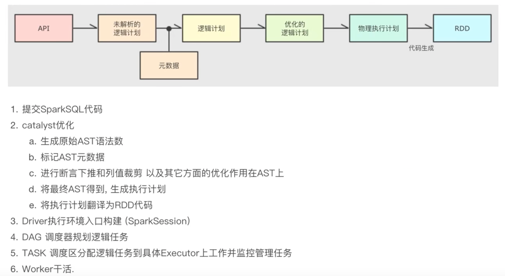

## 课程学习笔记

Wordcount
- 主构造方法、辅助构造方法

移动数据不如移动计算！【首选位置、优先位置】

血缘和依赖的关系
> a -> b -> c  ac没有直接依赖，是间接依赖，也是有依赖关系的。也就是a->c而血缘的话，只能是a-b-c

装饰者设计模式
 BufferedInputStream(new FileInputStream)

RDD，也体现了装饰者模式，将数据处理的逻辑进行了封装

控制反转（把处理逻辑传给一个函数）

Scala语言有一个makeRDD方法，而其他语言实现是没有的，makeRDD底层实现就是parallelize

分区跟并行计算有关。并行计算，有并行度的概念

parallelize()  	并行度：设置的并行度与2相比取最大
textFile		最小分区数：与2相比取最小值。底层是用的hadoopFile读取文件，会有分片的概念

计算切片，实际存数据  这是两个操作。

在存数据的时候，hadoop是按照行来读数据的。

分区跟task有关

所有RDD算子的计算功能全部由Executor执行。也就是 rdd.map( _ * xxx)
这个xxx是通过网络传输到Executor

### 20221128
分区的逻辑
- 直接创建数组
- 读取文件：底层用的是Hadoop的方法

### 20230828
三层架构：
- 控制层：controller，负责调度
- 服务层：service
- 持久层：DAO

- API层：接受SQL语句
- 收到SQL之后交给优化器，优化器负责解析SQL并生成执行计划
- 优化器最终输出的是RDD实质性计划
- 最后交给集群运行

Catalyst优化器

- 步骤1：生成抽象语法树
- 步骤2：在抽象语法树加上元数据信息
- 步骤3：对加入元数据的AST，输入优化器，进行优化 
  - 两种主要的优化：谓词下推（行过滤）、列值裁剪（列过滤）
  - Spark使用Parquet列式存储，能很方便进行列裁剪
- 步骤4：将AST生成执行计划，再将执行计划翻译成RDD代码

