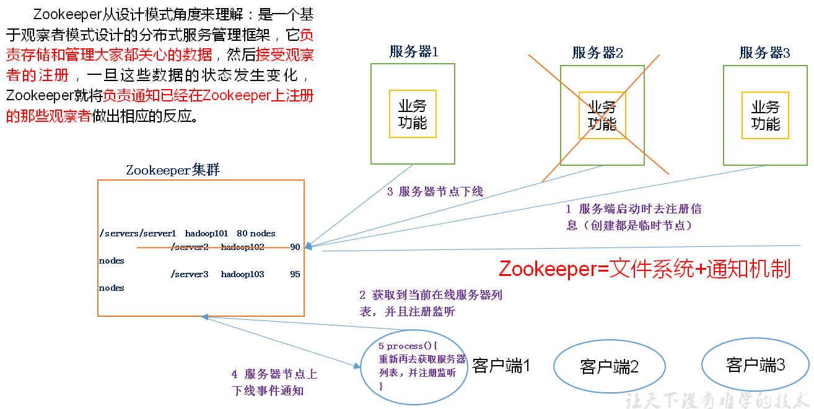

## ZooKeeper

Zookeeper是一个具有高可用性的高性能协调服务



特点：
- ZooKeeper：一个leader多个follower组成的集群
- 集群中只要有半数以上节点存活，ZooKeeper就能正常服务
- 全局数据一致：每个Server保存一份相同的数据副本，Client不论连到哪个Client，数据都是一致的
- 更新请求顺序进行，来自同一个Client的更新请求按其发送顺序依次执行
- 数据更新原子性，一次数据更新要么成功，要么失败
- 实时性，在一定时间范围内，Client能读到最新数据

数据结构：
- zk的数据模型跟Unix文件系统很类似，整体上可以看为一棵树，每个节点称为一个znode（没有目录和文件的区别）
- 每个znode默认能够存储1MB数据，每个znode都可以通过其路径唯一标识

应用场景：
- 传统javaEES场景：统一命名服务、统一配置管理、统一集群管理、服务器节点动态山下线、软负载均衡（zk记录每台服务器的访问数，让访问数最小的服务器去处理最新的客户端请求）等
- 大数据场景：HA、Kafka、HBase等

分布式应用的主要困难是会出现“部分错误”(partial failure)，这是分布式系统固有的特征。ZooKeeper可以提供一组工具，能够对部分失败进行正确的处理

> 部分失败： 一条消息在两个节点之间传送，发送网络错误，发送者无法知道接受者是否收到这条消息

独立模式运行zk的最低要求：
```
tickTime=2000
dataDir=/opt/modules/zookeeper-3.4.5/data/zkData
clientPort=2181
```

将ZooKeeper视为一个具有高可用性的文件系统，只不过没有文件和目录，而是统一使用节点node的概念，称为znode，同时具有文件和目录的功能

#### java API
- 创建组
- 加入组
    - 每个组成员作为一个程序运行
    - 当程序退出时，组成员应当从组中删除
    - 通过在ZooKeeper的命名空间中使用短暂znode来代表一个组成员
- 列出组成员
- 删除组
    - zookeeper不支持递归的删除操作，在删除父节点之前需要先删除子节点
    - delete需要提供两个参数：节点路径+版本号。一致才会删除，版本号设为-1的时候，会直接删除


#### ZooKeeper服务
从模型、操作、实现来了解Zookeeper提供的高性能协调服务
- 数据模型
    - Zookeeper维护这一个树形层次结构，树节点成为znode，并且有一个相关联的ACL，一个znode能存储的数据被限制在1MB以内
    - 数据访问具有原子性：要么全部读到，要么失败什么都读不到。写操作也一样。并且不支持添加操作。
    - 通过路径被引用。路径由Unicode字符串组成。zookeeper是系统保留关键词，不能作为路径。/zookeeper保存管理信息
    - 适合用于构建分布式引用的性质
        - 短暂znode：与客户端关联。客户端退出，短暂znode删除，表示应用退出
        - 顺序号：
        - 观察：观察机制，znode有状态有变更时通知观察者
- 操作
    ```
    create
    delete
    exists(判断是否存在同时查询元数据)
    getACL,setACL
    getChildren
    getData,setData
    sync(客户端znode视图与ZooKeeper同步)
    ```
    - 集合更新：多个基本操作集合成一个操作单元，确保要么同时成功执行，要么同时失败
    - 关于API
        - 执行exists()的时候有同步和异步两种情况。同步直接返回一个封装了元数据的Stat对象，异步则是void只是把操作通过参数传入
        > 同步：public Stat exists(String path, Watcher watcher)
        > 异步：public void exists(String path, Watcher watcher, StatCallable sc, Object ctx)
        - 异步在某些情况下可以提供更好的吞吐量。比如读取一大批znode并处理的时候，采用同步，每一个读操作都是堵塞
    - 观察触发器
        - exists/getChildren/getData上可以设置观察，分别被create/delete/setData触发。ACL操作不会触发观察。
        - todo：触发器类型《hadoop权威指南》第4版P620-621
    - ACL列表
        - todo：《hadoop权威指南》第4版P621
- 实现
    - 从概念上讲，ZooKeeper所做的就是确保对znode树的每个修改都会被复制到集群中超过半数的机器上
    - 使用了Zab协议，包括两个可以无限重复的阶段
        - 阶段1：领导者选举
        > 选择其中一台为leader，一旦半数以上的follower已经将状态与leader同步，则表明整个阶段完成。
        - 阶段2：原子广播
        > 所有写请求都转发给leader，由leader更新后把更新信息广播给follower。半数以上的follower将修改持久化后leader才会提交更新，然后客户端会受到更新成功的响应。整个过程要么成功要么失败，具有原子性
    - 领导者故障，会选举新的领导者，整个过程只需要大概200ms就可以完成。如果原来的领导者恢复，就会成为一个follower
- 一致性
    - zookeeper提供的一致性保证，主要有几点考虑：
        - 顺序一致性：每一个更新都会赋予一个全局唯一id，称为zxid
        - 原子性
        - 单一系统映像：不管客户端连接到哪台机器，看到的都是同样的系统视图
        - 持久性：一旦更新成功就会持久保存，不会被撤销，也不受服务器故障影响
        - 及时性：使用sync操作强制被连接的客户端去同步leader的状态
    - 一般情况下，领导负责提交写请求，跟随者负责响应读请求
    > leaderServer=no可以让领导者不接收任何客户端连接，只负责协调更新。超过3台服务器集群中推荐使用
- 会话
- 状态
    
---
ZooKeeper角色
- leader领导者，负责进行投票的发起和决议，更新系统状态
- learner
    - follower 跟随者，用于接受客户请求并向客户端返回结果，在选主过程中参与投票
    - observer 可以接受客户端连接，将写请求转发给leader节点，但不参与投票，只同步leader的状态。目的是为了扩展系统，提高读取速度
- client 请求发起方

ZooKeeper典型应用场景
- 统一命名服务 Name Service
- 配置管理
- 集群管理
- 共享锁/同步锁
> ZooKeeper从设计模型的角度讲，是一个基于观察者模式设计的分布式服务管理框架，负责存储和管理大家都关心的数据，然后接受观察者的注册。
> 一旦这些数据的状态发生变化，ZooKeeper就负责通知已经注册的观察者，从而实现类似于Master/Slave管理模式

相关命令
```
# 启动
bin/zkServer.sh start
# 查看状态
bin/zkServer.sh status
# 进入客户端
bin/zkCli.sh 
bin/zkCli.sh -server s00:2181 
```
客户端支持的命令
> 下面的命令加上 watch 以后，表示接受监听某个znode的变化，一个这个znode发生变化就会收到通知
```
[创建一个永久节点] create /forlearn 66611 
Created /forlearn

[查看节点] ls /forlearn
[]

[创建一个同样的节点是会失败的] create /forlearn 86611   
Node already exists: /forlearn
[创建的时候使用不同的节点值也不行] create /forlearn 88
Node already exists: /forlearn

[创建一个有序节点] create -s /forlearn 86611   # 这个时候是可以节点名字一样，zk会自动加上序号 
Created /forlearn0000000017  # 加上的这个序号是全局唯一的
[zk: localhost:2181(CONNECTED) 13] create -s /forlearn 86611
Created /forlearn0000000018

# 注册查看某个节点下的目录是否变更，注意：只有 /forlearn/sub 这个目录下新增或删除了节点，才会得到通知，且只通知一次，如果需要通知多次需要多次注册
[zk: localhost:2181(CONNECTED) 1] ls /forlearn/sub watch
[]
[zk: localhost:2181(CONNECTED) 2] 
WATCHER::

WatchedEvent state:SyncConnected type:NodeChildrenChanged path:/forlearn/sub

# 注册查看某个节点的值是否变化。注意，只有通过set /path data 让/forlearn/sub的值发生了变化，才会得到通知，也只通知一次
[zk: localhost:2181(CONNECTED) 7] get /forlearn/sub watch     
66
cZxid = 0x2d00000010
ctime = Sat Nov 02 00:47:35 CST 2019
mZxid = 0x2d00000010
mtime = Sat Nov 02 00:47:35 CST 2019
pZxid = 0x2d00000010
cversion = 0
dataVersion = 0
aclVersion = 0
ephemeralOwner = 0x0
dataLength = 2
numChildren = 0
[zk: localhost:2181(CONNECTED) 8] 
WATCHER::

WatchedEvent state:SyncConnected type:NodeDataChanged path:/forlearn/sub

# 设置节点值
[zk: localhost:2181(CONNECTED) 4] set /forlearn/sub 998
cZxid = 0x2d00000010
ctime = Sat Nov 02 00:47:35 CST 2019
mZxid = 0x2d00000014
mtime = Sat Nov 02 00:51:27 CST 2019
pZxid = 0x2d00000010
cversion = 0
dataVersion = 3
aclVersion = 0
ephemeralOwner = 0x0
dataLength = 3
numChildren = 0

# 查看节点状态
[zk: localhost:2181(CONNECTED) 6] stat /forlearn/sub
cZxid = 0x2d00000010  # 创建或修改操作的事务id，表示第Ox2d次启动，第00000010次操作
ctime = Sat Nov 02 00:47:35 CST 2019
mZxid = 0x2d00000014  # 最后更新的事务id，表示第Ox2d次启动，第00000014次操作（修改）
mtime = Sat Nov 02 00:51:27 CST 2019
pZxid = 0x2d00000015  # 最后更新子节点的zxid（事务id），同样表示第Ox2d次启动，第00000014次操作（修改）
cversion = 1          # 子节点变化号，znode子节点修改次数
dataVersion = 3       # 数据变化号
aclVersion = 0        # 访问控制列表的变化号
ephemeralOwner = 0x0  # 临时节点，这个是znode拥有者的session id。非临时节点则是0
dataLength = 3        # 节点的数据长度
numChildren = 1       # 子节点数

# 空节点删除
[zk: localhost:2181(CONNECTED) 15] delete /forlearn
Node not empty: /forlearn
# 递归删除
[zk: localhost:2181(CONNECTED) 16] rmr /forlearn   
```